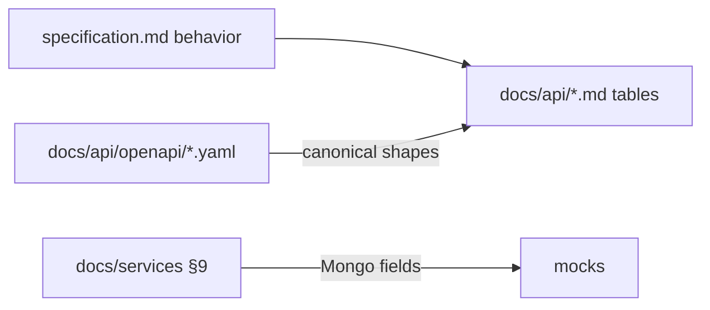

# HW3 — OpenAPI, Persistence, and Test Toolchain

## Goals and constraints

| Goal | Approach |
|------|----------|
| HTTP/data contracts via Swagger | Add **OpenAPI 3.1** YAML under [`homework-3/docs/api/openapi/`](homework-3/docs/api/openapi/) (Swagger UI–compatible; no runtime codegen in this homework) |
| One test stack | **Vitest only**; integration via **`@nestjs/testing` + `supertest`**; **npm workspaces** at `platform/` root |
| Per-service persistence | New **§9 Persistence schema** in each `docs/services/*.md` (6 DB-owning services) |
| No Hono | Remove Hono/`app.request()` references from HW3 testing docs; keep NestJS stack in [`agents.md`](homework-3/agents.md) |

**Out of scope:** Implementing `homework-3/platform/` code, `@nestjs/swagger` decorators, Docker/CI, or rewriting [`specification.md`](homework-3/specification.md) §1–§14 behavior. Only **additive docs** + light cross-links (Document map, source-of-truth table).

**Authority after this work:**

On conflict: **behavior** = `specification.md` + domain docs; **request/response JSON shape** = OpenAPI; **collection fields** = service §9.

---

## 1. OpenAPI (Swagger) contract package

### 1.1 File layout

Create:

| File | Contents |
|------|----------|
| [`docs/api/openapi/README.md`](homework-3/docs/api/openapi/README.md) | How to view (Swagger Editor / Redoc), validation note, link to markdown route tables |
| [`docs/api/openapi/components/schemas.yaml`](homework-3/docs/api/openapi/components/schemas.yaml) | Shared `$ref` targets |
| [`docs/api/openapi/public-bff.openapi.yaml`](homework-3/docs/api/openapi/public-bff.openapi.yaml) | All routes from [`public-routes.md`](homework-3/docs/api/public-routes.md) |
| [`docs/api/openapi/internal.openapi.yaml`](homework-3/docs/api/openapi/internal.openapi.yaml) | Routes from [`internal-routes.md`](homework-3/docs/api/internal-routes.md) + per-service internal paths |

Use **OpenAPI 3.1**, `servers: [{ url: /api/v1 }]` (public) and `/internal/v1` (internal). Tag by `SVC-*`.

### 1.2 Shared components (`schemas.yaml`)

Derive from existing docs and mocks (align IDs with [`mocks/`](homework-3/mocks/)):

- **Money:** `amount` as `string` with `pattern` for decimal (match spec §5 — not JSON `number` in API bodies)
- **Enums:** `source_system`, `role`, `direction`, `status`, `transaction_type` from [`canonical-banking-transaction-model.md`](homework-3/docs/domain/canonical-banking-transaction-model.md)
- **Core models:** `CanonicalTransaction`, `TransactionListResponse` (cursor pagination: `limit` default 50, max 200), `ImportPreview`, `ImportConfirmResponse`, `ApplyImportResult` (`created`, `updated`, `duplicate_skipped`, `review_required`)
- **Domain:** `BankConnection`, `ExportJobCreate`, `ExportJobStatus`, `BudgetPeriodDetail`, `AuditEvent`, `AuditEventAppend`
- **Errors:** `ErrorResponse` (`code`, `message`, `request_id`) mapped from [`errors-and-status-codes.md`](homework-3/docs/api/errors-and-status-codes.md)
- **Headers:** document `X-Request-Id`, `X-Actor-User-Id`, `X-Actor-Role` as parameters per [`headers.md`](homework-3/docs/api/headers.md)

### 1.3 Critical paths (full request/response examples)

Prioritize complete `paths` + `examples` for grader/agent clarity (remaining routes: summary `operationId` + `$ref` schemas):

| Flow | Public | Internal |
|------|--------|----------|
| Auth | `POST /auth/login`, `POST /auth/refresh` | — |
| Bank + import | `POST .../bank-connections`, `GET .../import-previews/{previewId}`, `POST .../confirm` | — |
| Ledger read | `GET .../transactions` | `GET /internal/v1/transactions`, `POST .../imports/{previewId}/apply` |
| Budget | `GET .../budget/periods/{periodId}` | — |
| Export | `POST .../exports`, `GET .../download` | — |
| Audit | `GET /ops/audit/events` | `POST /internal/v1/audit/events` |
| Identity | `GET .../members`, `POST .../erasure-requests` | `GET /internal/v1/memberships/resolve` |

### 1.4 Update markdown API docs

In [`public-routes.md`](homework-3/docs/api/public-routes.md), [`internal-routes.md`](homework-3/docs/api/internal-routes.md), and [`docs/README.md`](homework-3/docs/README.md) source-of-truth table:

- Add row: **HTTP JSON schemas** → `docs/api/openapi/` (canonical)
- Keep markdown route tables as **human index**; add one line: “Full schemas: OpenAPI files above”

Add to [`specification.md` Document map](homework-3/specification.md) (lines 665–680 only): link `docs/api/openapi/`.

---

## 2. Single test toolchain (Vitest + npm)

### 2.1 Documented standard (new file)

Add [`docs/architecture/monorepo-and-tooling.md`](homework-3/docs/architecture/monorepo-and-tooling.md):

| Topic | Decision |
|-------|----------|
| Package manager | **npm** (v10+) |
| Monorepo | **npm workspaces** at `homework-3/platform/package.json` |
| Workspaces | `apps/*`, `services/*` (8 packages: web, gateway-bff, 6 services) |
| Test runner | **Vitest 2.x** only — no Jest |
| Unit tests | Vitest in each package |
| Nest integration | `@nestjs/testing` `Test.createTestingModule` + **`supertest`** against `app.getHttpServer()` |
| DB integration | Document **MongoDB Memory Server** for local CI-friendly tests (assumed; no Docker required for homework) |
| Angular (later) | Vitest via `@analogjs/vitest-angular` or separate `ng test` — pick **Vitest for shared libs only** in MVP platform doc; web app E2E stays “E2E-doc” until Playwright |

Include a **hypothetical** root `package.json` snippet (documentation-only) with `"workspaces": ["apps/*", "services/*"]` and `"scripts": { "test": "npm run test -ws --if-present" }`.

### 2.2 Align existing HW3 docs (remove ambiguity)

| File | Change |
|------|--------|
| [`docs/testing/testing-strategy.md`](homework-3/docs/testing/testing-strategy.md) | Replace `Vitest/Jest` and `app.request()` with Vitest + supertest; link monorepo doc |
| [`agents.md`](homework-3/agents.md) §2, §8 | Add toolchain subsection; state **HW3 does not use Hono** |
| [`.cursor/skills/vitest-testing/SKILL.md`](homework-3/.cursor/skills/vitest-testing/SKILL.md) | Remove Hono line; document supertest pattern with short example |
| [`.cursor/rules/Vitest-Testing-Rules.mdc`](homework-3/.cursor/rules/Vitest-Testing-Rules.mdc) | Forbid Jest/`node:test`; require supertest for HTTP integration |
| [`platform/README.md`](homework-3/platform/README.md) | Link monorepo + OpenAPI + testing docs |

**Explicit non-goal:** Do not copy or reference repo-root Hono skills from homework-1/2 except a one-line “not applicable to HW3” in vitest skill Related section.

---

## 3. Per-service persistence detail (§9)

Add **§9 Persistence schema (Mongoose)** to each service doc that owns a DB. Reuse indexes from existing §3; add **field-level tables** (name, BSON type, required, constraints, notes).

| Service doc | Collections to expand |
|-------------|----------------------|
| [`identity-household.md`](homework-3/docs/services/identity-household.md) | `users`, `households`, `memberships`, `invitations`, `erasure_requests` — align [`household-family.json`](homework-3/mocks/household-family.json) |
| [`bank-connector.md`](homework-3/docs/services/bank-connector.md) | `connections`, `tokens` (encrypted blob ref only), `sync_checkpoints`, `import_previews` (+ embedded preview txn shape), `raw_payloads` TTL |
| [`ledger.md`](homework-3/docs/services/ledger.md) | `transactions` (canonical fields + `household_id`, `attributed_user_id`, `source_kind`), `import_batches`, `dedup_fingerprints` — align [`sample-transactions.json`](homework-3/mocks/sample-transactions.json); **store `amount` as Decimal128/string** |
| [`budget.md`](homework-3/docs/services/budget.md) | `categories`, `budget_periods`, `period_limits`, `user_envelopes` — align [`sample-budget-period.json`](homework-3/mocks/sample-budget-period.json) |
| [`export.md`](homework-3/docs/services/export.md) | `export_jobs`, `export_artifacts` — align [`sample-export-manifest.json`](homework-3/mocks/sample-export-manifest.json) |
| [`audit.md`](homework-3/docs/services/audit.md) | Expand existing event table into full `audit_events` collection schema + payload prohibitions |

[`gateway-bff.md`](homework-3/docs/services/gateway-bff.md): add short **§9 — No persistence** (confirms no Mongo).

Optional consolidation: add [`docs/persistence/README.md`](homework-3/docs/persistence/README.md) index linking all six DBs (navigation only, no duplicate tables).

### Cross-cutting persistence rules (repeat once in index README)

- One DB per service; no cross-DB writes
- `ledger_mvp.transactions` writable only by `SVC-LED`
- Preview txns live in `bank_mvp.import_previews` only until apply
- Tokens: encrypt at rest; never in audit `payload`

---

## 4. OpenAPI ↔ persistence consistency pass

After §9 and OpenAPI drafts:

1. Ensure `CanonicalTransaction` OpenAPI properties match ledger §9 + domain canonical doc (including `household_id`, `attributed_user_id` used in mocks but missing from domain entity table — **add to domain doc footnote or ledger §9 as service extensions**).
2. Ensure export/budget request bodies use `status: booked` default in OpenAPI `default` values.
3. Fix mock documentation note: [`mocks/README.md`](homework-3/mocks/README.md) — JSON fixtures may use numeric amounts for readability; **runtime/API/storage use string decimal** per spec §5.

---

## 5. Validation checklist (docs-only)

- [ ] Every route in `public-routes.md` appears in `public-bff.openapi.yaml`
- [ ] Apply + audit append + ledger internal read in `internal.openapi.yaml`
- [ ] No `homework-3` doc recommends Hono or Jest for HW3
- [ ] `docs/README.md` source-of-truth table includes OpenAPI + persistence index
- [ ] Link grep: no broken `../api/openapi` references
- [ ] Appendix B / §1–§14 unchanged except Document map link

---

## File change summary

| Action | Paths |
|--------|-------|
| **Create** | `docs/api/openapi/*` (4 files), `docs/architecture/monorepo-and-tooling.md`, optional `docs/persistence/README.md` |
| **Edit** | 7× `docs/services/*.md`, `docs/api/public-routes.md`, `internal-routes.md`, `docs/README.md`, `docs/testing/testing-strategy.md`, `agents.md`, `platform/README.md`, `mocks/README.md`, `specification.md` (Document map), `.cursor/skills/vitest-testing/SKILL.md`, `.cursor/rules/Vitest-Testing-Rules.mdc` |
| **Light edit** | `docs/domain/canonical-banking-transaction-model.md` (ledger-only fields note) |
| **Do not touch** | `homework-1/`, `homework-2/`, repo-root Hono skills |

Estimated size: ~600–900 lines of OpenAPI YAML + ~400 lines persistence tables across service docs.
