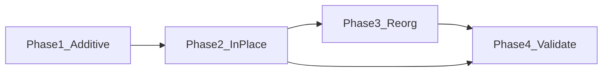
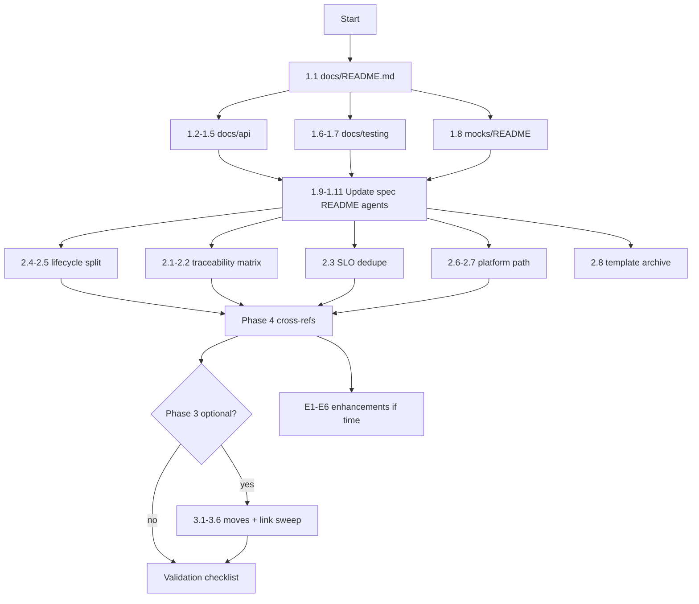

# HW3 Specification Package — Execution Plan

**Scope:** [homework-3/](homework-3/) documentation only (Package **A**). No `apps/`, `services/`, or `platform/` code. Graded artifacts per [TASKS.md](homework-3/TASKS.md) remain: `specification.md`, `agents.md`, `.cursor/rules/`, `README.md`.

**Principle:** Additive files first → in-place content fixes → optional moves with one-line redirect stubs at old paths → link sweep.



---

## 1. Gap-to-Fix Mapping

| ID | Problem | Why it matters | Exact fix | Spec / analysis basis |
|----|---------|----------------|-----------|------------------------|
| G1 | No consolidated API/HTTP contract | Implementers guess status codes and headers; §10 edge cases lack a single lookup | Add `docs/api/public-routes.md`, `internal-routes.md`, `errors-and-status-codes.md`, `headers.md` extracted from [architecture-overview.md](homework-3/docs/architecture-overview.md) + [docs/services/*.md](homework-3/docs/services/) + [specification.md §10](homework-3/specification.md) | §5 REST, §10 edge cases, §11 verification |
| G2 | Testing guidance split across §11, agents §8, service §7 | Agents pick inconsistent test boundaries | Add `docs/testing/testing-strategy.md` + `fixtures-guide.md` | §11 verification, [agents.md §8](homework-3/agents.md) |
| G3 | No docs navigation / source-of-truth index | Hard to onboard graders and agents | Add `docs/README.md` with reading order + authority table | Prior analysis: flat `docs/` |
| G4 | `scope-and-traceability.md` matrix labeled “stub” while §13 has 38 tasks | Signals incomplete work | Add `docs/registry/traceability-matrix.md` from [specification.md Appendix A](homework-3/specification.md); update scope doc to link and remove “stub” | Appendix A, [scope-and-traceability.md](homework-3/docs/scope-and-traceability.md) |
| G5 | SLO table duplicated in spec §4 and architecture-overview | Drift risk | Keep **canonical** table in `specification.md` §4; replace architecture duplicate with link + 1-line summary | §4 NFR |
| G6 | RBAC/ingestion summarized in spec and expanded in domain docs | Acceptable but no “who wins” rule | Add row in `docs/README.md`: canonical fields → canonical model; permissions → household-rbac; HTTP guards → api docs | §9, prior overlap analysis |
| G7 | `data-lifecycle.md` mixes MVP tokens/erasure with `PH2-OCR` receipt sections | Agents may scope-creep OCR retention | Add `docs/compliance/data-lifecycle-mvp.md` (extract MVP sections); add `data-lifecycle-phase2.md` (receipt/OCR); keep [data-lifecycle.md](homework-3/docs/data-lifecycle.md) as index linking both | §6 PH2-*, §14, existing MVP banner (lines 21–24) |
| G8 | Monorepo path ambiguous (`apps/` at repo root vs homework-3 only) | Future implementation breaks Appendix B scope guard | Add **Implementation location (documentation only)** subsection in [agents.md §3](homework-3/agents.md) and [specification.md §12](homework-3/specification.md): specs stay under `homework-3/`; hypothetical code at `homework-3/platform/` (not repo root, not homework-1/2) | Appendix B, agents §3 |
| G9 | `specification-TEMPLATE-example.md` beside real spec | Agent/human confusion | Move to `docs/_archive/specification-TEMPLATE-example.md` with 3-line stub at old path | TASKS deliverables list (not required) |
| G10 | ~36+ links to flat `docs/*.md` paths | Breaks if files move without stubs | After any move: leave stub files at old paths (`> Moved to ...`) | Safe migration (prior analysis) |
| G11 | Cursor rules under `homework-3/.cursor/rules/` only | May not load in multi-homework workspace | **Enhancement:** optional repo-root `.cursor/rules/homework-3-*.mdc` pointing to HW3 rules | TASKS editor rules deliverable |
| G12 | Mocks lack field glossary | Fixture misuse in tests | Add `mocks/README.md` | §11 fixtures, Mars Family §9 |
| G13 | Internal auth “mTLS or service token” undecided | Blocks consistent internal route docs | Document **MVP default: signed service token** in `docs/api/internal-routes.md` (labeled assumed) | §5 implementation notes |

**Out of scope for this plan (defer):** Creating `homework-3/platform/` code tree, OpenAPI YAML, Docker/CI, root `node_modules` — not required by [TASKS.md](homework-3/TASKS.md).

---

## 2. Execution Plan (Phased)

### Phase 1 — Additive foundation (no moves)

**Goal:** Fill G1–G3, G12 without touching existing file paths.

| Task | Action | Files affected | Prereq | Risk |
|------|--------|----------------|--------|------|
| 1.1 | Create `docs/README.md`: reading order (registry → architecture → domain → api → services → mocks), source-of-truth table (G6) | New | None | Low |
| 1.2 | Create `docs/api/public-routes.md`: aggregate BFF `/api/v1` table from [architecture-overview.md § REST](homework-3/docs/architecture-overview.md) | New | None | Low |
| 1.3 | Create `docs/api/internal-routes.md`: BANK→LED apply, writers→AUD, BUD/EXP→LED reads; default service token (G13) | New | 1.2 | Low |
| 1.4 | Create `docs/api/errors-and-status-codes.md`: map each [§10](homework-3/specification.md) row to HTTP + audit event | New | None | Low |
| 1.5 | Create `docs/api/headers.md`: `X-Request-Id`, `X-Actor-User-Id`, Bearer JWT | New | §5 | Low |
| 1.6 | Create `docs/testing/testing-strategy.md`: unit/integration/E2E-doc matrix per MO-* | New | §11 | Low |
| 1.7 | Create `docs/testing/fixtures-guide.md`: when to use each file in [mocks/](homework-3/mocks/) | New | 1.6 | Low |
| 1.8 | Create `mocks/README.md`: fixture IDs, roles, `hh_mars_001` rules | New | [household-family.json](homework-3/mocks/household-family.json) | Low |
| 1.9 | Update [specification.md Document map](homework-3/specification.md) (lines 662–672): add api/, testing/, docs/README | Edit | 1.1–1.7 | Low |
| 1.10 | Update [README.md Package layout](homework-3/README.md) (lines 88–113): mirror new folders | Edit | 1.1–1.8 | Low |
| 1.11 | Update [agents.md §10](homework-3/agents.md): add api + testing rows | Edit | 1.2–1.7 | Low |

**Parallelizable:** 1.2–1.8 can run in parallel after 1.1 outline exists.

---

### Phase 2 — In-place content fixes (no reorg)

**Goal:** G4, G5, G7, G8, G9 without breaking links.

| Task | Action | Files affected | Prereq | Risk |
|------|--------|----------------|--------|------|
| 2.1 | Create `docs/registry/traceability-matrix.md` copying Appendix A table + MO→TASK prefix summary | New | Phase 1 | Low |
| 2.2 | Edit [scope-and-traceability.md](homework-3/docs/scope-and-traceability.md): rename “Traceability matrix (stub)” → link to `registry/traceability-matrix.md`; keep ID registry as canonical | Edit | 2.1 | Low |
| 2.3 | Edit [architecture-overview.md](homework-3/docs/architecture-overview.md) § Assumed SLO: replace full table with link to [specification.md §4](homework-3/specification.md#4-non-functional-and-policy) (G5) | Edit | None | Low |
| 2.4 | Split lifecycle content (G7): create `docs/compliance/data-lifecycle-mvp.md` + `data-lifecycle-phase2.md`; trim [data-lifecycle.md](homework-3/docs/data-lifecycle.md) to index + MVP pointer (keep receipt section only in phase2 file) | New + edit | None | Medium |
| 2.5 | Update links in [agents.md](homework-3/agents.md), [compliance-ukraine.md](homework-3/docs/compliance-ukraine.md), service docs that cite `data-lifecycle.md` → index or `-mvp` as appropriate | Edit | 2.4 | Medium |
| 2.6 | Add **Implementation location** to [agents.md §3](homework-3/agents.md): `homework-3/platform/` for future code; specs/mocks never under `platform/` (G8) | Edit | None | Low |
| 2.7 | Add one paragraph to [specification.md §12](homework-3/specification.md) beginning context aligning with 2.6 | Edit | 2.6 | Low |
| 2.8 | Move [specification-TEMPLATE-example.md](homework-3/specification-TEMPLATE-example.md) → `docs/_archive/`; stub at old path (G9) | Move + stub | None | Low |

**Parallelizable:** 2.1, 2.3, 2.6, 2.8 in parallel; 2.4 before 2.5.

---

### Phase 3 — Optional structural reorg (redirect-safe)

**Goal:** Implement Package (A) tree from prior analysis **only if** navigation still feels crowded after Phase 1–2. **Skip entirely** if time-boxed—Phase 1–2 already resolve critical gaps.

| Task | Action | Files affected | Prereq | Risk |
|------|--------|----------------|--------|------|
| 3.1 | Move `scope-and-traceability.md` → `docs/registry/scope-and-traceability.md`; stub at old path (G10) | Move | Phase 2 | Medium |
| 3.2 | Move domain docs → `docs/domain/` (canonical, dedup, bank-provider, ingestion, rbac) | Move ×5 | 3.1 | Medium |
| 3.3 | Move `compliance-ukraine.md` + lifecycle files → `docs/compliance/` | Move | 2.4 | Medium |
| 3.4 | Move `architecture-overview.md` → `docs/architecture/` | Move | 2.3 | Low |
| 3.5 | Update all links in `specification.md`, `README.md`, `agents.md`, `.cursor/rules/*.mdc`, service docs “Related documents” | Edit | 3.1–3.4 | High |
| 3.6 | Run link grep (see §6) until zero broken `docs/` references | Verify | 3.5 | — |

**Recommendation:** Treat Phase 3 as **optional**. Phases 1–2 deliver 90% of value with near-zero link risk.

---

### Phase 4 — Cross-reference and agent alignment

**Goal:** Single entry path for humans and agents.

| Task | Action | Files affected | Prereq | Risk |
|------|--------|----------------|--------|------|
| 4.1 | Add “Start here” bullet to [README.md](homework-3/README.md) § How to read: `docs/README.md` first | Edit | Phase 1 | Low |
| 4.2 | Update [agents.md §11 workflow](homework-3/agents.md): step 0 = `docs/README.md`; step for api/errors before coding | Edit | Phase 1 | Low |
| 4.3 | Update [.cursor/rules/Stack-Domain-Rules.mdc](homework-3/.cursor/rules/Stack-Domain-Rules.mdc): point to `docs/api/errors-and-status-codes.md` for 403/409 behavior | Edit | 1.4 | Low |
| 4.4 | Add `docs/phase2/roadmap.md` excerpting [specification.md §14](homework-3/specification.md) only (no new requirements) | New | None | Low |

---

## 3. Architecture and Structural Changes

### Target structure (after Phase 1–2; Phase 3 optional)

```text
homework-3/
  specification.md          # unchanged role; Document map expanded
  agents.md                 # §3 path + reference table
  README.md
  TASKS.md
  specification-TEMPLATE-example.md   # stub → archive (Phase 2)
  .cursor/rules/
  docs/
    README.md               # NEW — navigation + source of truth
    registry/
      traceability-matrix.md    # NEW
      scope-and-traceability.md # Phase 3 move OR stay at docs/ root
    api/                    # NEW
      public-routes.md
      internal-routes.md
      errors-and-status-codes.md
      headers.md
    testing/                # NEW
      testing-strategy.md
      fixtures-guide.md
    compliance/             # Phase 2 split (partial) / Phase 3 move
      compliance-ukraine.md
      data-lifecycle.md         # index
      data-lifecycle-mvp.md
      data-lifecycle-phase2.md
    architecture/           # Phase 3 optional
      architecture-overview.md
    domain/                 # Phase 3 optional
      canonical-banking-transaction-model.md
      deduplication-reconciliation-specification.md
      ...
    services/               # unchanged location (low churn)
    phase2/
      roadmap.md
    _archive/
      specification-TEMPLATE-example.md
  mocks/
    README.md               # NEW
    *.json
```

### How this aligns with the spec

| Spec concern | Structural improvement |
|--------------|------------------------|
| §4 NFR / SLOs | Single canonical SLO table in `specification.md`; architecture doc defers |
| §5 REST, internal routes, correlation id | `docs/api/*` is the implementer contract layer |
| §10 edge cases | `errors-and-status-codes.md` is the behavioral HTTP catalog |
| §11 verification | `docs/testing/*` centralizes MO-* → test type → fixture |
| §12 context beginning/ending | `agents.md` + §12 clarify `homework-3/` vs `homework-3/platform/` |
| §13 tasks + Appendix A | `registry/traceability-matrix.md` is the living task index |
| §6 / §14 PH2 | `phase2/roadmap.md` + lifecycle phase2 file isolate deferred scope |
| MO-7 erasure / tokens | `data-lifecycle-mvp.md` matches MVP banks only |

**No module splits** in application code—this plan only reorganizes documentation.

---

## 4. Additional Improvements (Enhancements — not required fixes)

| Enhancement | Description | When |
|-------------|-------------|------|
| E1 | Repo-root `.cursor/rules/homework-3-stack.mdc` with `globs: homework-3/**` including key constraints from Stack-Domain-Rules | After Phase 4; fixes G11 for multi-hw workspace |
| E2 | `mocks/bank-payloads/{mono,otp,privat24}-sample.json` minimal raw provider JSON for adapter unit tests (documented in fixtures-guide) | After 1.7; supports §7 BankProvider |
| E3 | `docs/architecture/configuration.md`: env var names per SVC-* (no secrets) | After 1.3 |
| E4 | `docs/architecture/data-ownership.md`: extract table from architecture-overview § Data ownership | After 1.1 |
| E5 | Appendix in `testing-strategy.md`: “SLO verification hooks” (p95, pagination 50/200, export 50k)—documentation only | After 1.6 |
| E6 | `platform/` README placeholder under `homework-3/platform/README.md` pointing to spec §13 (no Nest scaffold) | After 2.6; clarifies G8 without code |

**Explicitly deferred:** OpenAPI YAML, `packages/contracts` TypeScript, Docker Compose, CI, implementation of §13 tasks.

---

## 5. Implementation Order (Critical Path)



**Must be first:** 1.1 `docs/README.md` (defines authority rules before other new docs reference it).

**Parallel after 1.1:** api bundle (1.2–1.5), testing bundle (1.6–1.7), mocks README (1.8).

**Before Phase 3:** Complete Phase 2 lifecycle split (2.4) so compliance folder content is stable.

**Defer:** Phase 3 reorg unless grader/agent navigation is still painful; E1–E6 anytime after Phase 4.

---

## 6. Validation Checklist

### Spec compliance (graded artifacts unchanged in substance)

- [ ] [specification.md](homework-3/specification.md) still contains §1–§14, 38 tasks, §10 edge table, §4 SLO table, Appendix A/B
- [ ] [TASKS.md](homework-3/TASKS.md) deliverables present: `specification.md`, `agents.md`, `.cursor/rules/`, `README.md`
- [ ] No new MVP features (no PH2 implementation tasks added)
- [ ] Locked decisions in Appendix B still satisfied (confirm import, CSV-only, booked-only, Mars Family, ledger sole writer)

### Structural validation

- [ ] New folders exist: `docs/api/`, `docs/testing/`, `docs/registry/` (and `docs/compliance/` after 2.4)
- [ ] If Phase 3 run: every moved file has stub at old path with correct relative link
- [ ] [README.md Package layout](homework-3/README.md) matches actual tree
- [ ] [specification.md Document map](homework-3/specification.md) links resolve in GitHub/Cursor preview

### Link integrity (run from repo root)

```powershell
# Expect 0 matches for broken old paths after Phase 3 (adjust pattern if skipped)
rg "docs/scope-and-traceability" homework-3 --glob "*.md" 
rg "docs/canonical-banking" homework-3 --glob "*.md"
# Manual: open specification.md, click 5 random doc links
```

- [ ] Grep `](docs/` in `homework-3` — no links to non-existent paths
- [ ] Service docs `Related documents` sections updated if domain paths moved

### Content quality gates

- [ ] `errors-and-status-codes.md` covers all 12 §10 scenarios with HTTP + audit column
- [ ] `testing-strategy.md` has one row per MO-1…MO-8 matching §11
- [ ] `traceability-matrix.md` matches Appendix A task counts
- [ ] `data-lifecycle-mvp.md` does not require receipt storage for MVP DoD
- [ ] `agents.md` §3 states: specs in `homework-3/`; code in `homework-3/platform/` (doc only)

### Agent/human smoke test

- [ ] Read path: README → docs/README → specification §1 → api/errors → relevant service doc → mock fixture
- [ ] Confirm `PH2-OCR` only appears in phase2 roadmap / phase2 lifecycle / spec §6§14

**No build/test/lint required** — specification-only homework; optional markdown lint if project adds it later.

---

## Effort estimate

| Phase | Approx. files touched | Time (focused) |
|-------|----------------------|----------------|
| Phase 1 | ~12 new, ~4 edits | 2–3 h |
| Phase 2 | ~8 new/edit | 2 h |
| Phase 3 (optional) | ~15 moves + ~20 link edits | 3–4 h |
| Phase 4 | ~5 edits | 1 h |
| Enhancements | ~6 optional | 1–2 h |

**Minimum viable fix (Phases 1–2 + 4, skip 3):** ~5–6 hours; addresses all **required** gaps G1–G9 except optional folder aesthetics (G10 partial via no moves).
