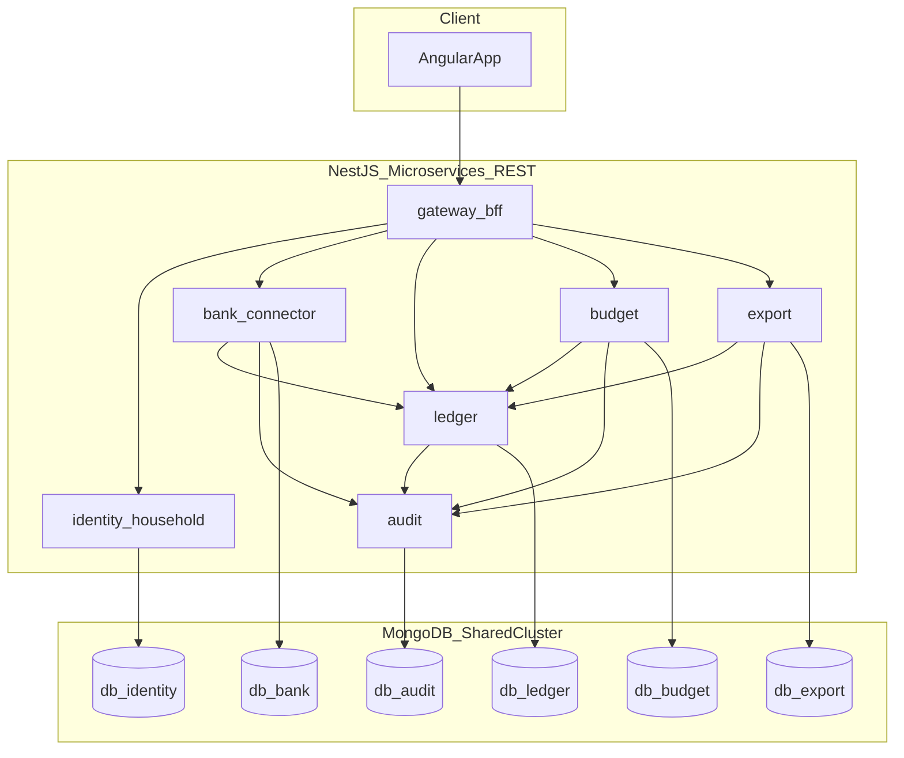

# HW3 Specification Creation Plan

## Goal and constraints

- **In scope:** Documents only under [`homework-3/`](homework-3/) — no changes to [`homework-1/`](homework-1/) or [`homework-2/`](homework-2/).
- **Graded artifact:** [`homework-3/specification.md`](homework-3/specification.md) must satisfy the layered structure and cross-cutting requirements in [`homework-3/TASKS.md`](homework-3/TASKS.md) (edge cases, verification, performance/SLOs, 15–30+ low-level tasks with DoD).
- **Existing assets to reuse (extend, do not duplicate blindly):**
  - [`homework-3/docs/canonical-banking-transaction-model.md`](homework-3/docs/canonical-banking-transaction-model.md)
  - [`homework-3/docs/deduplication-reconciliation-specification.md`](homework-3/docs/deduplication-reconciliation-specification.md)
  - [`homework-3/docs/data-lifecycle.md`](homework-3/docs/data-lifecycle.md)
  - [`homework-3/.cursor/rules/Agent-Output-Rules.mdc`](homework-3/.cursor/rules/Agent-Output-Rules.mdc) (already present; keep, add stack rules separately)

## Product snapshot (locked decisions)

| Area | Decision |
|------|----------|
| Product | Household budget app aggregating bank transactions (Mono, OTP, Privat24 via abstract `BankProvider`) |
| MVP flows | Bank connect/sync + confirm import, budget (booked txns only), CSV export |
| Phase 2 (spec mention only) | File upload, OCR receipts, manual cash |
| Stack | Angular, NestJS, MongoDB; **REST** between services |
| Data | **One DB per service** on a **shared MongoDB cluster** (separate DB names); note **PostgreSQL migration** as post-MVP option |
| Budget visibility | **Admins:** household-wide; **users/viewers:** per-user scope |
| Import confirm | **Admin** and **superadmin** can confirm; document superadmin override |
| Export | **CSV** only in MVP |
| Jurisdiction | **Ukraine** (UA personal data law, UAH / ISO 4217) |
| Integration style | REST + scheduled sync jobs (no event bus in MVP) |
| OCR policy | Always confirm (applies when Phase 2 is described) |

## Target file tree (end state)

```text
homework-3/
  specification.md          # FINAL synthesis (primary deliverable)
  agents.md
  README.md
  .cursor/rules/
    Agent-Output-Rules.mdc  # existing
    Stack-Domain-Rules.mdc  # NEW: Nest/Angular/Mongo/FinTech UA
  docs/
    canonical-banking-transaction-model.md   # UPDATE: MVP scope + Phase 2 pointer
    deduplication-reconciliation-specification.md  # minor cross-refs
    data-lifecycle.md                        # minor cross-refs
    ingestion-sources-matrix.md              # NEW
    bank-provider-adapter.md                 # NEW: port + Mono/OTP/Privat24 deltas
    household-rbac.md                        # NEW: roles + permission matrix
    compliance-ukraine.md                    # NEW: privacy, retention, audit refs
    architecture-overview.md                 # NEW: services, REST map, cluster DB names
    services/                                # NEW: per-service beginning/ending context
      gateway-bff.md
      identity-household.md
      bank-connector.md
      ledger.md
      budget.md
      export.md
      audit.md
  mocks/
    household-family.json                    # NEW: family + relatives fixture
    sample-transactions.json                 # NEW: booked UAH examples per bank
    sample-budget-period.json                # NEW: categories/limits vs actuals
    sample-export-manifest.json              # NEW: CSV column spec + redaction flags
```



---

## Phase 1 — Scope, traceability, and outline

**Objective:** Freeze IDs and section outline so later docs and `specification.md` stay aligned.

1. Define **document IDs** used everywhere: `MO-1`…`MO-n` (mid-level objectives), `SVC-*` (services), `PH2-*` (Phase 2 sources).
2. Write a one-page **spec outline** (internal checklist, can live at top of draft or in `docs/architecture-overview.md`):
   - North star + explicit **out of scope for MVP** (OCR, manual cash, file upload) with **Phase 2** subsection
   - 6–8 mid-level objectives mapped to MVP flows
   - Traceability matrix stub: MO → services → low-level task prefixes
3. Align MVP objectives to TASKS graders:
   - MO bank ingest (provider port, confirm import, idempotent ledger write)
   - MO household RBAC
   - MO budget (booked only, admin household-wide vs user scope)
   - MO CSV export + audit
   - MO compliance/audit (Ukraine, immutable audit trail)
   - MO ops/compliance read-only export/audit views

**Exit criteria:** Outline approved; no contradictions with user decisions (admin confirm, CSV, shared cluster DB names).

---

## Phase 2 — Supporting reference documents (build blocks)

Write/update docs **before** drafting full `specification.md`. Each doc ends with a short **“Spec incorporation”** note listing which `specification.md` sections will cite it.

### 2.1 Ingestion and providers

| File | Content |
|------|---------|
| [`docs/ingestion-sources-matrix.md`](homework-3/docs/ingestion-sources-matrix.md) | Full matrix: Mono, OTP, Privat24 (High); Phase 2 rows for file/OCR/manual (Medium/Low) marked **deferred** with same columns (trust, validation, idempotency, confirmation) |
| [`docs/bank-provider-adapter.md`](homework-3/docs/bank-provider-adapter.md) | `BankProvider` port (authenticate, listAccounts, fetchTransactions, incremental checkpoint, revoke); **per-bank deltas** table (auth style, ID field names, pagination, webhook optional, error codes); mapping to canonical model |
| Update [`docs/canonical-banking-transaction-model.md`](homework-3/docs/canonical-banking-transaction-model.md) | Clarify **bank-only** in MVP; add `source_kind` / Phase 2 extension note; single rule for **amount sign vs direction** to avoid implementer ambiguity |

### 2.2 Household, mocks, compliance

| File | Content |
|------|---------|
| [`docs/household-rbac.md`](homework-3/docs/household-rbac.md) | Roles: superadmin, admin, user, viewer; permission matrix (connect bank, **confirm import**, view txns, budget edit, export, disconnect, erasure); **admin can confirm**; superadmin superset |
| [`mocks/household-family.json`](homework-3/mocks/household-family.json) | **Mock household “Mars Family”:** mother = superadmin, father = admin, son + daughter = user, cat = viewer (labeled non-human profile for demo), uncle + niece = viewer relatives; include household_id, user_ids, role bindings |
| [`docs/compliance-ukraine.md`](homework-3/docs/compliance-ukraine.md) | UA personal data protection references, data minimization, erasure SLA (link to [`data-lifecycle.md`](homework-3/docs/data-lifecycle.md)), audit retention, assumptions for abstract bank APIs |

### 2.3 Architecture and data platform

| File | Content |
|------|---------|
| [`docs/architecture-overview.md`](homework-3/docs/architecture-overview.md) | Service list, REST boundaries, **DB name per service** on shared cluster, post-MVP PostgreSQL migration note, no cross-service collection writes |
| [`mocks/sample-transactions.json`](homework-3/mocks/sample-transactions.json) | Small booked UAH set referencing mock users/accounts |
| [`mocks/sample-budget-period.json`](homework-3/mocks/sample-budget-period.json) | Monthly envelope vs booked spend using visibility rules |
| [`mocks/sample-export-manifest.json`](homework-3/mocks/sample-export-manifest.json) | CSV columns, PII fields, redaction for viewer role |

**Exit criteria:** All new docs exist; existing dedup/lifecycle docs have cross-links; mocks validate against canonical field names.

---

## Phase 3 — Per-service beginning/ending context

Create one file per service under [`homework-3/docs/services/`](homework-3/docs/services/). Each file uses the same template:

1. **Purpose** and owned aggregates  
2. **Beginning context** (empty monorepo / service skeleton hypothetical)  
3. **Ending context** (collections, indexes, key REST resources, callers/callees)  
4. **MongoDB DB name** on shared cluster (e.g. `budget_mvp`, `ledger_mvp`)  
5. **REST endpoints** (method + path + role guard) — documentation only  
6. **Verification hooks** (what tests prove for this service)  
7. **Phase 2 touchpoints** (if any; else “none in MVP”)

| Service file | MVP focus |
|--------------|-----------|
| `gateway-bff.md` | Angular-facing aggregation, auth propagation, no business logic |
| `identity-household.md` | Users, roles, household, invitations; mock family seed reference |
| `bank-connector.md` | Provider adapters, tokens (see lifecycle doc), preview + **confirm import** job |
| `ledger.md` | Canonical txn store, dedup engine integration, booked-only reads for budget/export |
| `budget.md` | Categories, periods, limits; rollup rules; visibility filter |
| `export.md` | CSV job, async generation, download, audit |
| `audit.md` | Append-only events from all services |

**Exit criteria:** Seven service docs complete; REST map in `architecture-overview.md` matches; ledger is sole writer of `transactions` collection.

---

## Phase 4 — Draft `specification.md` (layer by layer)

Build [`homework-3/specification.md`](homework-3/specification.md) in **sections**, pulling summarized content from Phase 2–3 docs (spec is self-contained enough to grade without opening every doc, but links to `docs/` for depth).

### Section order (matches TASKS table)

1. **High-level objective** — unified household budget truth from bank APIs; MVP boundary sentence.  
2. **Mid-level objectives** — `MO-1`…`MO-8` with observable outcomes.  
3. **Stakeholders** — end-users (household), ops/compliance; optional support.  
4. **Non-functional and policy** — security, UA privacy, audit, reliability; **assumed SLO table** (REST p95, import job duration, export max rows, pagination).  
5. **Implementation notes** — TS stack, decimal money, idempotency keys, booked-only, REST, Mongo per service, PostgreSQL later.  
6. **Ingestion sources** — summarized matrix + Phase 2 deferred sources (explicit mention).  
7. **BankProvider** — summarized port + three-bank variation highlights.  
8. **Canonical model and dedup** — summaries + links to full docs.  
9. **Household RBAC** — matrix + pointer to mock family JSON.  
10. **Edge cases and failure modes** — table scoped to MVP (token revoke mid-import, duplicate overlap, viewer export denied, empty budget month, export during sync, cat/viewer edge case as permission test).  
11. **Verification** — per MO: unit/integration/e2e-as-docs, fixtures (`mocks/`), reconciliation checks, compliance review steps.  
12. **Context beginning / ending** — platform-level hypothetical repo + per-service subsection (condensed from `docs/services/*`).  
13. **Low-level tasks** — **20–35 tasks**, each with: `MO-x` tag, prompt-style intent, target service/file path (hypothetical Nest/Angular layout), acceptance criteria / DoD.  
14. **Phase 2 roadmap** — OCR/file/manual cash, cross-source dedup, optional PostgreSQL.

**Exit criteria:** `specification.md` draft complete; TASKS cross-cutting items appear in spec body, not only README.

---

## Phase 5 — `agents.md` and Cursor stack rules

### [`homework-3/agents.md`](homework-3/agents.md)

- Stack: Angular (strict), NestJS modules, Mongoose per service DB  
- Monorepo layout convention (hypothetical `apps/` + `services/`)  
- FinTech rules: never log tokens/PAN/full account numbers; idempotent ingest; booked-only for budget  
- Ukraine/compliance pointers to `docs/compliance-ukraine.md`  
- Testing expectations mapped to verification section  
- Edge-case handling (confirm import, dedup, erasure)  
- Links to canonical, dedup, lifecycle, provider docs  

### [`homework-3/.cursor/rules/Stack-Domain-Rules.mdc`](homework-3/.cursor/rules/Stack-Domain-Rules.mdc)

- Nest/Angular/Mongo naming, named exports, no `any`  
- Service boundary rules (ledger owns transactions)  
- FinTech-sensitive defaults  
- `alwaysApply: true` or scoped globs under `homework-3/` only  

**Exit criteria:** TASKS deliverable #2 and #3 satisfied alongside existing `Agent-Output-Rules.mdc`.

---

## Phase 6 — `README.md` and cross-doc polish

### [`homework-3/README.md`](homework-3/README.md)

Per TASKS table:

- Student name + homework summary  
- **Rationale:** microservices choice, Mongo per service + PostgreSQL note, MVP scope, performance target reasoning  
- **Industry best practices:** idempotency, audit trail, UA privacy, confirmation before ingest — with **section anchors** into `specification.md` and `docs/*`  

### Polish pass on existing docs

- Add “See `specification.md` §X” backlinks in canonical, dedup, lifecycle docs  
- Ensure dedup doc states **cross-source receipt vs bank out of MVP**  
- Fix any naming consistency (`source_system` enum values, role names)

**Exit criteria:** README complete; doc graph consistent.

---

## Phase 7 — Final integration and “Mars” checklist

Single editing pass on [`homework-3/specification.md`](homework-3/specification.md) only:

1. **Traceability audit** — every `MO-x` has ≥2 low-level tasks and ≥1 verification line.  
2. **No orphan decisions** — admin confirm, CSV, booked-only, cluster DB names, mock family appear in spec.  
3. **Grader skim test** — edge cases + SLOs + 20+ tasks visible without opening `docs/`.  
4. **Scope guard** — Phase 2 sources mentioned but not implemented in tasks.  
5. **Homework isolation** — confirm git diff only under `homework-3/`.

| Check | Source |
|-------|--------|
| Layered spec | TASKS.md table |
| agents.md + rules + README | TASKS deliverables |
| FinTech/UA compliance | compliance doc + spec NFR |
| Supporting depth | docs + mocks |

---

## Suggested implementation order (step-by-step)

Execute phases **sequentially**; within Phase 2, order: ingestion matrix → bank provider → RBAC + mocks → architecture → service docs (Phase 3) → specification sections (Phase 4) → agents/rules/README (5–6) → final pass (7).

## Role assignment for mock family (fixed in plan)

| Member | Role | Notes |
|--------|------|--------|
| Mother | superadmin | Full household control |
| Father | admin | Can confirm bank import; household-wide budget view |
| Son, Daughter | user | Per-user transaction visibility |
| Cat | viewer | Demo profile; read-only, no export |
| Uncle, Niece | viewer | Related viewers, no bank connect |

Son/Daughter default to **user** unless you prefer viewer for minors — document choice in `household-rbac.md`.

## Out of scope for this plan

- Application source code, Docker, CI, real bank API keys  
- Changes outside [`homework-3/`](homework-3/)
