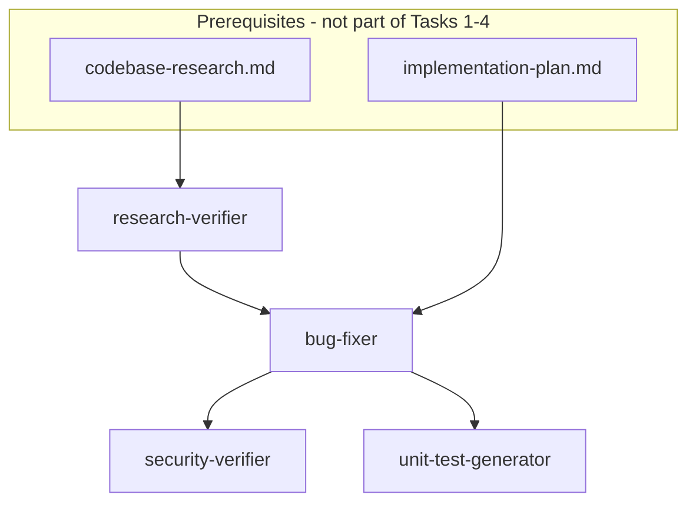
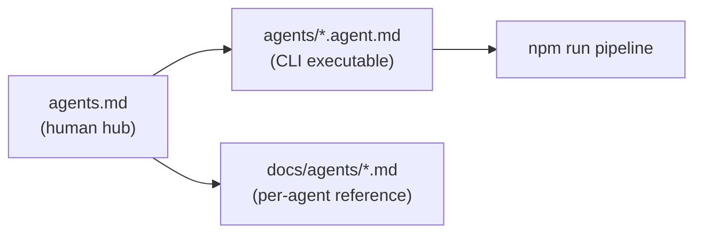

# Homework-4: Agents (Tasks 1–4) + Pipeline Plan

**Scope:** Tasks 1–4 (agent definitions + skills) and single-command pipeline. **Out of scope:** Task 5 sample app (`src/`, seeded bugs) — pipeline will expect upstream artifacts in `context/` but not implement the app yet.

**Current state:** [homework-4/TASKS.md](homework-4/TASKS.md) exists; no `agents/`, `skills/`, or pipeline code yet. Reuse repo conventions from [homework-1](homework-1/) (Node + Vitest + Hono patterns) and existing project skills [`.cursor/skills/vitest-testing/SKILL.md`](.cursor/skills/vitest-testing/SKILL.md) / [`.cursor/skills/hono-backend/SKILL.md`](.cursor/skills/hono-backend/SKILL.md) as references for the test generator agent.

---

## Target layout

```text
homework-4/
├── package.json                 # "pipeline": "tsx scripts/run-pipeline.ts"
├── scripts/
│   ├── run-pipeline.ts          # CLI orchestrator
│   └── lib/
│       ├── parse-agent.ts       # read *.agent.md frontmatter + body
│       ├── load-skill.ts        # inline skill markdown into prompt
│       └── run-agent-step.ts    # spawn `agent` CLI
├── agents/
│   ├── research-verifier.agent.md
│   ├── bug-fixer.agent.md
│   ├── security-verifier.agent.md
│   └── unit-test-generator.agent.md
├── skills/
│   ├── research-quality-measurement.md   # Task 1.2
│   └── unit-tests-FIRST.md               # Task 4.2
├── context/bugs/BUG-001/        # skeleton; Task 5 fills real content
│   ├── bug-context.md           # placeholder
│   ├── research/
│   │   ├── codebase-research.md # INPUT (from Bug Researcher — pre-seeded stub for now)
│   │   └── verified-research.md # OUTPUT Task 1
│   ├── implementation-plan.md   # INPUT (from Bug Planner — pre-seeded stub)
│   ├── fix-summary.md           # OUTPUT Task 2
│   ├── security-report.md       # OUTPUT Task 3
│   └── test-report.md           # OUTPUT Task 4
├── agents.md                    # central agent guidelines hub (HW4 pipeline)
├── docs/
│   ├── README.md                # docs index
│   ├── agents/                  # per-agent reference pages
│   │   ├── README.md            # agent catalog + I/O matrix
│   │   ├── research-verifier.md
│   │   ├── bug-fixer.md
│   │   ├── security-verifier.md
│   │   └── unit-test-generator.md
│   └── screenshots/             # pipeline run, fixes, security, tests (post-Task 5)
├── .cursor/
│   └── README.md                # local rules/skills index (optional HW4 rules later)
├── README.md                    # submission overview + links to agents.md
└── HOWTORUN.md                  # Cursor CLI install, auth, pipeline command
```

> Note: TASKS.md shows `homework-5/` in the structure block — implement under **`homework-4/`** per the actual assignment folder.

---

## Pipeline architecture



**Run order (per TASKS):** Research Verifier → Bug Fixer → **(parallel)** Security Verifier + Unit Test Generator.

**Orchestration:** `npm run pipeline` → `tsx scripts/run-pipeline.ts`:

1. Resolve `BUG_ID` (default `BUG-001`) and `homework-4` as workspace cwd.
2. **Preflight:** fail fast if `context/bugs/{BUG_ID}/research/codebase-research.md` or `implementation-plan.md` missing (Task 5 will supply real files; until then, add minimal **stub inputs** so pipeline is testable).
3. For each step, load the matching [agents/*.agent.md](homework-4/agents/) + referenced [skills/*.md](homework-4/skills/), build a single prompt, and invoke **Cursor CLI** headlessly:

```bash
agent -p --force --model "<from frontmatter>" --workspace "<homework-4 abs path>" "<composed prompt>"
```

4. After Bug Fixer completes, run Security Verifier and Unit Test Generator with `Promise.all` (two separate `agent` processes).
5. **Post-check:** verify expected output files exist; print summary + exit code non-zero on failure.

**Why Cursor CLI (not `@cursor/sdk`):** Matches your preference for a **package.json job/CLI**; no extra SDK dependency; same `CURSOR_API_KEY` / `agent login` auth as headless docs. Use `cross-spawn` for Windows PowerShell compatibility.

**Skill auto-loading:** Each `.agent.md` frontmatter lists `skills:` paths; orchestrator reads file contents and prepends: *"Apply the following skill verbatim when executing this step:"* — satisfies TASKS requirement to load related skills automatically.

---

## Task 1: Research Verifier + research-quality skill

### 1.2 Skill — [skills/research-quality-measurement.md](homework-4/skills/research-quality-measurement.md)

Define a **4-level rubric** (example names — finalize in implementation):

| Level | Label | Criteria (summary) |
|-------|-------|-------------------|
| L1 | Unusable | Many broken refs; snippets don't match; planner cannot act |
| L2 | Weak | Some valid refs; gaps in root-cause or file coverage |
| L3 | Adequate | Majority refs verified; actionable for planner |
| L4 | Strong | All refs + snippets verified; clear repro/fix hints |

Include:
- Scoring checklist (reference accuracy, snippet fidelity, coverage, actionability)
- **Required output template** for `verified-research.md`:
  - Verification Summary (pass/fail + quality level)
  - Verified Claims
  - Discrepancies Found
  - Research Quality Assessment (level + reasoning)
  - References

### 1.1 Agent — [agents/research-verifier.agent.md](homework-4/agents/research-verifier.agent.md)

```yaml
---
name: research-verifier
description: Fact-check Bug Researcher output against source files
model: claude-sonnet-5-thinking-high   # strong reasoning for line-by-line verification
skills:
  - skills/research-quality-measurement.md
---
```

**Body instructions (key points):**
- Read `context/bugs/{BUG_ID}/research/codebase-research.md`
- For each `file:line` claim: open source, confirm snippet equality, record pass/fail
- Write **only** `context/bugs/{BUG_ID}/research/verified-research.md` using skill template
- Do not edit application source; discrepancies listed explicitly for Bug Planner

**Model rationale (for README):** Thinking/reasoning model for meticulous cross-file verification.

---

## Task 2: Bug Fixer

### Agent — [agents/bug-fixer.agent.md](homework-4/agents/bug-fixer.agent.md)

```yaml
---
name: bug-fixer
description: Apply implementation plan, run tests, document changes
model: composer-2.5-fast   # faster model for deterministic code edits
skills: []                 # optional: reference vitest-testing via prompt @ path
```

**Body instructions:**
1. Read `context/bugs/{BUG_ID}/implementation-plan.md` (and optionally `verified-research.md`)
2. Apply file changes exactly as specified (before/after blocks)
3. After each change (or batch): run `npm test` from `homework-4/` — **stop on failure**, document in summary
4. Write `context/bugs/{BUG_ID}/fix-summary.md` with sections: Changes Made, Overall Status, Manual Verification, References

**Task 5 note:** Agent paths reference `src/` relative to homework-4; no app code until Task 5 lands.

---

## Task 3: Security Verifier

### Agent — [agents/security-verifier.agent.md](homework-4/agents/security-verifier.agent.md)

```yaml
---
name: security-verifier
description: Security review of modified code; report only
model: claude-opus-4-8-thinking-high   # deep security reasoning
skills: []
```

**Body instructions:**
- Read `fix-summary.md` + changed files listed there
- Scan: injection, secrets, insecure comparisons, missing validation, unsafe deps, XSS/CSRF if relevant
- Rate each finding: CRITICAL / HIGH / MEDIUM / LOW / INFO with `file:line` + remediation
- Write **only** `security-report.md` — **no source edits** (consider `--mode=ask` in orchestrator for this step, or explicit "read-only" in prompt)
- Scope to production/runtime paths (not devDependencies noise)

---

## Task 4: Unit Test Generator + FIRST skill

### 4.2 Skill — [skills/unit-tests-FIRST.md](homework-4/skills/unit-tests-FIRST.md)

Define **FIRST** with concrete checklists:

- **F**ast — no network/sleep; small fixtures
- **I**ndependent — fresh store/state per test
- **R**epeatable — deterministic; no clock/random without mocking
- **S**elf-validating — clear pass/fail assertions
- **T**imely — tests target changed behavior only

Reference Vitest + `app.request()` patterns from existing [vitest-testing skill](.cursor/skills/vitest-testing/SKILL.md).

### 4.1 Agent — [agents/unit-test-generator.agent.md](homework-4/agents/unit-test-generator.agent.md)

```yaml
---
name: unit-test-generator
description: Generate and run unit tests for changed code only
model: composer-2.5-fast
skills:
  - skills/unit-tests-FIRST.md
```

**Body instructions:**
- Read `fix-summary.md` + changed files
- Add/update tests under `tests/` **only for new/changed code**
- Run `npm test`; capture pass/fail counts
- Write `test-report.md`: files created/updated, FIRST checklist self-assessment, test run output summary

---

## Pipeline script details

**[scripts/run-pipeline.ts](homework-4/scripts/run-pipeline.ts)** — step registry:

| Step | Agent file | Writes | Parallel group |
|------|-----------|--------|----------------|
| 1 | research-verifier | verified-research.md | sequential |
| 2 | bug-fixer | fix-summary.md + src edits | sequential |
| 3a | security-verifier | security-report.md | parallel |
| 3b | unit-test-generator | test-report.md + tests/ | parallel |

**Prompt composition template:**

```text
You are executing the "{name}" agent for homework-4 bug {BUG_ID}.

## Agent instructions
{body from .agent.md}

## Skills (mandatory)
{inlined skill markdown}

## Paths
Workspace: homework-4/
Bug context: context/bugs/{BUG_ID}/
```

**package.json** (minimal):

```json
{
  "name": "homework-4",
  "type": "module",
  "scripts": {
    "pipeline": "tsx scripts/run-pipeline.ts",
    "test": "vitest run"
  },
  "devDependencies": { "tsx": "^4.x", "typescript": "^6.x", "vitest": "^4.x" }
}
```

`npm test` stub can point to Vitest with empty/passing placeholder until Task 5 adds real tests.

---

## Agents documentation (new deliverable)

Follow the homework-3 pattern ([`homework-3/agents.md`](homework-3/agents.md)) but tailored to the **4-agent bug-fix pipeline**. Documentation is separate from the executable `agents/*.agent.md` definitions: those files drive the CLI; these docs explain the system to humans and graders.

### [agents.md](homework-4/agents.md) — central hub

Single entry point for any agent (or student) working in `homework-4/`. Required sections:

1. **Pipeline context** — purpose, full run order (Researcher → Verifier → Planner → Fixer → Security + Tests), mermaid from TASKS
2. **Workspace scope** — work under `homework-4/` only; Task 5 owns `src/` + `tests/`
3. **Agent catalog table** — name, role, model, skills, inputs, outputs, edit permissions (read-only vs write)
4. **Model selection rationale** — same table as README but with fuller justification per agent
5. **Context layout** — `context/bugs/{BUG_ID}/` artifact contract (what each file means, who writes it)
6. **Skills index** — links to `skills/research-quality-measurement.md` and `skills/unit-tests-FIRST.md` with when each agent must apply them
7. **Agent workflow** — read order before acting (e.g. verifier reads research + source; fixer reads plan + verified research)
8. **Pipeline invocation** — `npm run pipeline`, `BUG_ID` env var, parallel security + test steps
9. **Upstream agents (out of scope for Tasks 1–4)** — Bug Researcher and Bug Planner documented as producers of `codebase-research.md` and `implementation-plan.md` so the pipeline story is complete
10. **AI usage notes** — what was authored manually vs with Cursor; what to verify without AI

Cross-link: [`TASKS.md`](homework-4/TASKS.md), [`HOWTORUN.md`](homework-4/HOWTORUN.md), [`docs/agents/README.md`](homework-4/docs/agents/README.md).

### [docs/agents/](homework-4/docs/agents/) — per-agent reference pages

One markdown page per pipeline agent (human-readable companion to each `*.agent.md`):

| File | Contents |
|------|----------|
| `README.md` | Agent catalog; **I/O matrix** (input paths → output paths); pipeline step numbers; links to skills |
| `research-verifier.md` | Role, responsibilities, success criteria from Task 1; skill usage; `verified-research.md` section template; example discrepancy format |
| `bug-fixer.md` | Role, 4-step process from Task 2; test gate behavior; `fix-summary.md` section template |
| `security-verifier.md` | Role, vulnerability classes to scan; severity scale; report-only constraint; `security-report.md` finding template |
| `unit-test-generator.md` | Role, FIRST skill checklist; changed-code-only rule; `test-report.md` template; Vitest conventions pointer |

Each page should include:
- Link to the executable definition: `agents/<name>.agent.md`
- **Inputs / outputs** table with concrete paths under `context/bugs/{BUG_ID}/`
- **Do / don't** list (e.g. security agent: do write report, don't edit `src/`)
- **Success criteria** copied from TASKS.md for that task

### [docs/README.md](homework-4/docs/README.md) — docs index

Short navigation page listing:
- `docs/agents/` — agent reference
- `docs/screenshots/` — evidence for PR (populated after pipeline runs)
- Link back to `agents.md` and root `README.md`

### [.cursor/README.md](homework-4/.cursor/README.md) — Cursor config index (optional, lightweight)

Mirror homework-3 style: document any HW4-local rules/skills if added later. For Tasks 1–4, at minimum list:
- Homework skills in `skills/` (not `.cursor/skills/` unless mirrored)
- Repo-root skills reused by test generator (`vitest-testing`, `hono-backend`)
- Pointer to `agents.md` as startup read

### Relationship: three agent-related artifacts



- **`agents/*.agent.md`** — prompts + frontmatter consumed by `run-pipeline.ts`
- **`agents.md`** — narrative, workflow, model rationale, grader-facing AI usage story
- **`docs/agents/*.md`** — deep reference per role without duplicating full prompt bodies

---

## Documentation (submission-facing)

**[README.md](homework-4/README.md):**
- Author/student info (per root [README.md](README.md))
- Homework summary + deliverables table (link to [`agents.md`](homework-4/agents.md))
- 4-agent overview + mermaid (from TASKS)
- **Model justification table** (agent → model → why) — summary; detail in `agents.md`
- Note Task 5 provides `src/` and seeded bugs

**[HOWTORUN.md](homework-4/HOWTORUN.md):**
- Install Cursor CLI (`irm ... | iex` on Windows)
- `agent login` or `CURSOR_API_KEY`
- `cd homework-4 && npm install && npm run pipeline`
- Expected artifacts after run (link to `docs/agents/README.md` I/O matrix)
- Prerequisite: `codebase-research.md` + `implementation-plan.md` must exist (Task 5 / manual seed)

---

## Stub inputs (until Task 5)

To validate Tasks 1–4 **before** the sample app exists, add **minimal placeholder** inputs under `context/bugs/BUG-001/`:

- `research/codebase-research.md` — 2–3 claims pointing at future `src/` files (marked TBD)
- `implementation-plan.md` — skeleton plan structure

Task 5 replaces these with real bug research tied to the Hono mini-app. Pipeline preflight should warn if stubs still contain `TBD`.

---

## Integration boundary with Task 5

| Task 5 delivers | Pipeline consumes |
|----------------|-------------------|
| `src/` + `tests/` with seeded bugs | Bug Fixer edits; Test Generator extends |
| `bug-context.md` | Researcher/Planner context (upstream) |
| Real `codebase-research.md` | Research Verifier input |
| Real `implementation-plan.md` | Bug Fixer input |

After Task 5: run full upstream flow (Researcher → Verifier → Planner → Fixer → Security + Tests) end-to-end; capture screenshots for PR.

---

## Verification checklist (after implementation)

1. `skills/research-quality-measurement.md` and `skills/unit-tests-FIRST.md` exist with rubrics + templates
2. All four `agents/*.agent.md` have `model:` in frontmatter and reference skills where required
3. `agents.md` exists with pipeline context, agent catalog, model rationale, context layout, and workflow
4. `docs/agents/` has README + four per-agent reference pages with I/O tables and TASKS success criteria
5. `docs/README.md` indexes agent docs and screenshots folder
6. Root `README.md` links to `agents.md` and includes author info + model summary table
7. `npm run pipeline` runs all four agents without manual intervention between steps
8. Security + test steps launch in parallel after fixer
9. Output files created at paths under `context/bugs/BUG-001/`
10. `HOWTORUN.md` documents CLI install + auth on Windows
