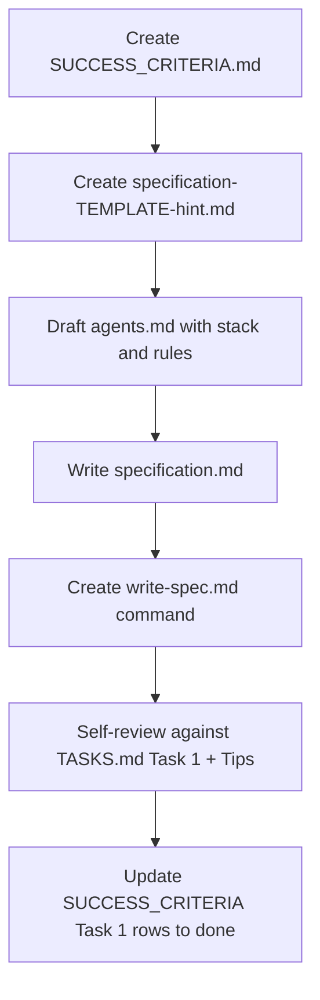

# HW6 Task 1 — Specification Plan

## Current state

- [homework-6/](homework-6/) contains only [`TASKS.md`](homework-6/TASKS.md) and [`sample-transactions.json`](homework-6/sample-transactions.json) — no code, no starter `agents.md`, no `specification-TEMPLATE-hint.md` (referenced in TASKS but missing).
- Tech stack is locked per [`.cursor/plans/hw6_tech_stack_description_0cde1919.plan.md`](.cursor/plans/hw6_tech_stack_description_0cde1919.plan.md): **Node.js 18+ / TypeScript / Hono / Vite+Svelte 5 / decimal.js / Vitest / MCP**.
- Third pipeline stage (user choice): **Compliance Check** (not Reporting).

---

## Deliverable A — Live Success Criteria checklist

Create [`homework-6/SUCCESS_CRITERIA.md`](homework-6/SUCCESS_CRITERIA.md) as a **separate, execution-time checklist** (distinct from the static table in TASKS.md). Structure:

```markdown
# HW6 Success Criteria (live checklist)
> Update status during execution: ⬜ pending · ✅ done · ❌ blocked

## Task 1 — Specification (Agent 1)
- [ ] specification.md — all 5 sections present
- [ ] Low-level task per pipeline stage (validator, fraud, compliance)
- [ ] agents.md with project context
- [ ] /write-spec slash command works

## Task 2 — Pipeline …
… (all 13 criteria from TASKS.md Success Criteria table)

## Tips for Success (process checks)
- [ ] Spec completed before any pipeline code
- [ ] Sample transactions analyzed; expected outcomes documented
- [ ] context7 queries planned for Task 2
- [ ] Screenshots captured during development
- [ ] Presentation PDF generated before deadline
```

**Usage rule:** After each task milestone, flip relevant rows to ✅ and note blockers inline. This file is the single source of truth for submission readiness.

---

## Deliverable B — Task 1 files

| File | Purpose |
|------|---------|
| [`homework-6/specification.md`](homework-6/specification.md) | Primary graded spec |
| [`homework-6/agents.md`](homework-6/agents.md) | AI agent hub (create from scratch — no starter exists) |
| [`homework-6/.cursor/commands/write-spec.md`](homework-6/.cursor/commands/write-spec.md) | `/write-spec` slash command (Agent 1 skill) |
| [`homework-6/specification-TEMPLATE-hint.md`](homework-6/specification-TEMPLATE-hint.md) | Condensed template for the skill to reference (adapt from [homework-3 archive](homework-3/docs/_archive/specification-TEMPLATE-example.md)) |

---

## `specification.md` content design

### 1. High-Level Objective (one sentence)

> Process raw banking transactions from `sample-transactions.json` through a file-based TypeScript pipeline (validation → fraud detection → compliance check) and expose results via `shared/results/`, a Hono API, and a Svelte dashboard.

### 2. Mid-Level Objectives (5 testable items)

Ground each objective in observable outcomes from the 8 sample transactions:

| ID | Objective | Verifiable via |
|----|-----------|----------------|
| MO-1 | Reject invalid records at validation (bad currency, non-positive amount) with `status: rejected` and `reason` in `shared/results/` | TXN006 (`XYZ`), TXN007 (`-100.00`) |
| MO-2 | Flag high-value transactions (≥ **$10,000 USD** equivalent) for fraud review with a numeric `risk_score` | TXN002 ($25k), TXN005 ($75k) |
| MO-3 | Elevate fraud score for cross-border (`metadata.country` ≠ `US`) and unusual timing (**02:00–05:00 UTC**) | TXN004 (02:47 UTC, DE/EUR) |
| MO-4 | Compliance stage enforces reporting thresholds (e.g. wire transfers ≥ $10k require `compliance_status: flagged`; aggregate run summary) | TXN002, TXN005 wire types |
| MO-5 | Every stage writes an audit log line: ISO 8601 timestamp, stage name, `transaction_id`, outcome — **no plaintext account numbers or names** | All stages |

### 3. Implementation Notes

Copy/adapt from tech stack plan:

- **Stack paragraph** (TypeScript pipeline, Hono API, Svelte 5 dashboard, decimal.js, Vitest, MCP)
- **Money:** `decimal.js` (`Decimal` type) — never `number`/`float` for amounts
- **Currency:** ISO 4217 whitelist (`USD`, `EUR`, `GBP`, `JPY`, …); reject unknown codes
- **Inter-stage protocol:** JSON envelope per [TASKS.md lines 90–104](homework-6/TASKS.md) in `shared/input|processing|output|results/`
- **Logging:** structured audit trail; mask accounts as `ACC-****` if referenced
- **Project layout** (planned, for downstream tasks):

```text
homework-6/
  src/
    orchestrator.ts          # loads sample data, runs stages
    pipeline/
      validator.ts
      fraud-detector.ts
      compliance.ts
    api/                     # Hono app (Task 2)
  frontend/                  # Vite + Svelte 5 (Task 2)
  shared/{input,processing,output,results}/
  tests/
  mcp/
```

### 4. Context

**Beginning state:**
- `sample-transactions.json` — 8 records (see expected outcomes table below)
- Empty `shared/` directories (created by orchestrator)
- No pipeline code

**Ending state (full capstone — referenced for traceability, built in Tasks 2–5):**
- All 8 transactions appear in `shared/results/` (approved, fraud-review, or rejected)
- `pipeline-summary.json` with pass/fail/review counts
- Vitest coverage ≥ 90% (gate ≥ 80%)
- Hono API + Svelte dashboard + MCP server + docs

**Expected outcomes table** (embed in spec — drives all later tasks):

| ID | Amount | Currency | Signals | Expected final status |
|----|--------|----------|---------|----------------------|
| TXN001 | 1500.00 | USD | normal transfer | `approved` |
| TXN002 | 25000.00 | USD | wire, high-value | `fraud_review` → compliance `flagged` |
| TXN003 | 9999.99 | USD | just under $10k | `approved` |
| TXN004 | 500.00 | EUR | 02:47 UTC, DE | `fraud_review` |
| TXN005 | 75000.00 | USD | wire, very high | `fraud_review` → compliance `flagged` |
| TXN006 | 200.00 | XYZ | invalid currency | `rejected` (validation) |
| TXN007 | -100.00 | GBP | negative amount | `rejected` (validation) |
| TXN008 | 3200.00 | USD | normal mobile | `approved` |

### 5. Low-Level Tasks (one per pipeline stage)

Use the **exact HW6 format** from TASKS.md:

```
Task: [Stage Name]
Prompt: "[Exact prompt for code generation agent]"
File to CREATE: path
Function to CREATE: signature
Details: rules, inputs, outputs, error cases
```

**Stage 1 — Validation** (`src/pipeline/validator.ts`)
- Required fields: `transaction_id`, `timestamp`, `source_account`, `destination_account`, `amount`, `currency`, `transaction_type`, `description`
- Parse `amount` with `decimal.js`; must be `> 0`
- Validate `currency` against ISO 4217 set
- Validate `timestamp` is ISO 8601
- Output: envelope with `data.status = "validated"` or write rejection directly to `shared/results/`
- Dry-run flag (`--dry-run`) for later `/validate-transactions` skill

**Stage 2 — Fraud Detection** (`src/pipeline/fraud-detector.ts`)
- Base `risk_score` 0–100
- +40 if amount ≥ $10,000 USD (compare via `decimal.js`, USD-equivalent for EUR/GBP using fixed demo rates or same-currency threshold)
- +25 if `metadata.country !== "US"`
- +20 if hour (UTC) is 02:00–05:00
- +15 if `transaction_type === "wire_transfer"`
- `fraud_review` if score ≥ 50; else `approved` (pass to compliance)
- Attach `risk_score` and `fraud_signals[]` to envelope `data`

**Stage 3 — Compliance Check** (`src/pipeline/compliance.ts`)
- Flag `compliance_status: flagged` when: wire transfer AND amount ≥ $10,000 OR fraud score ≥ 50
- Otherwise `compliance_status: cleared`
- Write final record to `shared/results/{transaction_id}.json` with `final_status`, `reason`, compliance fields
- Emit `pipeline-summary.json` after processing all records

Each task entry includes a **copy-paste-ready Prompt** string for Agent 2 (Task 2).

---

## `agents.md` structure

Model after [homework-4/agents.md](homework-4/agents.md) but for the 4-agent capstone workflow:

1. **Workspace rule** — work only under `homework-6/`
2. **Four-agent workflow** — mermaid diagram: Spec → Code → Tests/Hooks → Docs
3. **Tech stack table** — from tech stack plan
4. **Pipeline architecture** — mermaid flowchart: `sample-transactions.json` → orchestrator → validator → fraud → compliance → `shared/results/` → Hono API → Svelte UI
5. **Fraud/compliance rules summary** — quick reference from spec
6. **Expected outcomes table** — link to spec §4
7. **File layout** — directory tree
8. **Repo-root skills to reuse** — `hono-backend`, `vitest-testing`, `commit-messages`, `pr-messages`
9. **Student name** — Maxim Ogorodnikov (consistent with HW1)

---

## `/write-spec` slash command

Create [`homework-6/.cursor/commands/write-spec.md`](homework-6/.cursor/commands/write-spec.md):

```markdown
---
description: Generate or refresh homework-6/specification.md from the project template
---

Generate a complete transaction pipeline specification for homework-6.

Steps:
1. Read homework-6/TASKS.md (Task 1 requirements)
2. Read homework-6/specification-TEMPLATE-hint.md
3. Read homework-6/sample-transactions.json and homework-6/agents.md
4. Apply tech stack from agents.md (Node/TS/Hono/Svelte/decimal.js)
5. Write homework-6/specification.md with all 5 sections:
   - High-Level Objective (one sentence)
   - Mid-Level Objectives (4–5 testable items)
   - Implementation Notes (money, currency, logging, PII, stack)
   - Context (beginning + ending state, expected outcomes table)
   - Low-Level Tasks (one per stage: Validation, Fraud Detection, Compliance Check)
6. Use the HW6 low-level task format (Task / Prompt / File / Function / Details)
7. Do not write implementation code — specification only
```

---

## Execution order (Task 1 only)



1. Create `SUCCESS_CRITERIA.md` with all capstone criteria (Task 1 rows first).
2. Add condensed `specification-TEMPLATE-hint.md` (HW6-specific, not full HW3 spec).
3. Write `agents.md` — establishes stack, rules, and expected outcomes **before** the full spec (feeds both spec and later tasks).
4. Write `specification.md` — the detailed, self-contained graded artifact.
5. Add `.cursor/commands/write-spec.md`.
6. Self-review checklist:
   - All 5 spec sections present
   - 3 low-level tasks with exact Prompt strings
   - decimal.js / ISO 4217 / PII / logging called out
   - Compliance (not Reporting) as third stage
   - Expected outcomes cover all 8 transactions
7. Mark Task 1 rows ✅ in `SUCCESS_CRITERIA.md`.

---

## Tips for Success — applied to Task 1

| Tip | How Task 1 addresses it |
|-----|-------------------------|
| Spec first, code second | Task 1 produces complete spec before any `src/` code |
| Read sample transactions | Expected outcomes table maps every TXN001–TXN008 |
| Screenshot every step | Defer screenshots to Task 3+; note in SUCCESS_CRITERIA |
| One stage at a time | Low-level tasks are isolated per stage with clear I/O |
| Use context7 | Note in agents.md / spec that Agent 2 will query Hono, decimal.js, Svelte MCP docs |

---

## Out of scope for Task 1

- No `package.json`, pipeline code, tests, hooks, MCP, or frontend (Tasks 2–5)
- No git commit unless you ask
