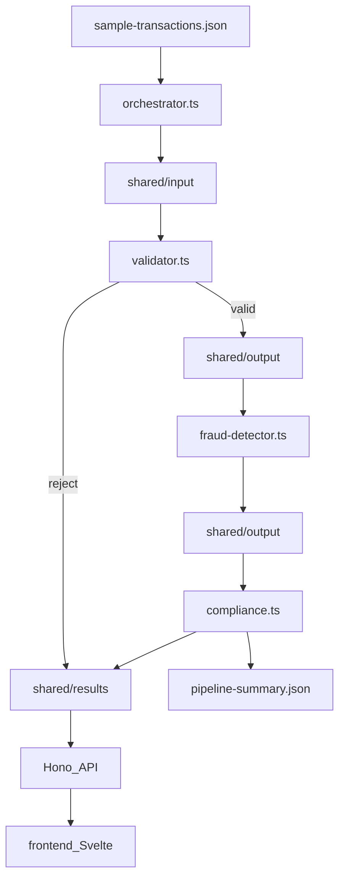

# HW6 Task 2 — Build Transaction Processing Pipeline

## Starting point

Task 1 is complete. Available artifacts:

- [`homework-6/specification.md`](homework-6/specification.md) — business rules, envelope format, expected outcomes for all 8 TXNs
- [`homework-6/agents.md`](homework-6/agents.md) — stack, fraud/compliance scoring reference
- [`homework-6/sample-transactions.json`](homework-6/sample-transactions.json) — input data
- [`homework-6/SUCCESS_CRITERIA.md`](homework-6/SUCCESS_CRITERIA.md) — Task 2 rows to update on completion

No `package.json` or `src/` yet — greenfield scaffold under `homework-6/`.

**Reference patterns:** Hono factory app from [`homework-1/src/app.ts`](homework-1/src/app.ts); Svelte 5 + Vite from [`homework-4/`](homework-4/); follow [`.cursor/skills/hono-backend/SKILL.md`](.cursor/skills/hono-backend/SKILL.md).

---

## Architecture



### Stage handoff rules

| Step | Reads | Writes |
|------|-------|--------|
| Orchestrator | `sample-transactions.json` | `shared/input/*.json` envelopes |
| Validator | `shared/input/` | valid → `shared/output/`; reject → `shared/results/{id}.json` |
| Fraud | `shared/output/` (read-all-first) | refreshed `shared/output/` |
| Compliance | `shared/output/` | `shared/results/{id}.json` + `pipeline-summary.json` |

Each stage uses `shared/processing/` as a scratch dir while working (move file in → process → move out). Orchestrator clears `input/`, `processing/`, `output/` at run start; `results/` cleared or overwritten per run.

---

## Phase 1 — Project scaffold

Create root [`homework-6/package.json`](homework-6/package.json):

```json
{
  "type": "module",
  "scripts": {
    "pipeline": "tsx src/orchestrator.ts",
    "validate": "tsx src/pipeline/validator.ts --dry-run",
    "dev:api": "tsx watch src/api/server.ts",
    "dev": "npm run dev --prefix frontend",
    "build": "npm run build --prefix frontend",
    "test": "vitest run"
  }
}
```

**Dependencies:** `hono`, `@hono/node-server`, `decimal.js`  
**DevDependencies:** `typescript`, `tsx`, `@types/node`, `vitest` (minimal; full test suite is Task 5)

Also add:

| File | Purpose |
|------|---------|
| [`homework-6/tsconfig.json`](homework-6/tsconfig.json) | strict ESM, `moduleResolution: bundler` |
| [`homework-6/.gitignore`](homework-6/.gitignore) | `node_modules`, `shared/**` except `.gitkeep` |
| [`homework-6/shared/{input,processing,output,results}/.gitkeep`](homework-6/shared/) | preserve directory structure |

---

## Phase 2 — Shared modules (before stages)

Build foundation modules used by all stages:

### [`homework-6/src/types.ts`](homework-6/src/types.ts)

- `RawTransaction` — shape from `sample-transactions.json`
- `PipelineEnvelope` — inter-stage message per spec §3
- `ValidationResult`, `FraudResult`, `ComplianceResult`, `FinalResult`
- `PipelineSummary` — counts object for `pipeline-summary.json`

### [`homework-6/src/pipeline/constants.ts`](homework-6/src/pipeline/constants.ts)

- `VALID_CURRENCIES = ['USD','EUR','GBP','JPY']`
- `USD_RATES` — EUR 1.08, GBP 1.27, USD 1.00
- `FRAUD_THRESHOLD = 50`, `HIGH_VALUE_USD = 10000`
- Required field list

### [`homework-6/src/pipeline/money.ts`](homework-6/src/pipeline/money.ts)

- `parseAmount(s: string): Decimal | null` using `decimal.js`
- `toUsdEquivalent(amount: Decimal, currency: string): Decimal`
- `isHighValue(amount, currency): boolean`

### [`homework-6/src/pipeline/audit-log.ts`](homework-6/src/pipeline/audit-log.ts)

- `logAudit(stage, transactionId, outcome)` → `console.log(JSON.stringify({...}))`
- No PII — never log accounts or description

### [`homework-6/src/pipeline/fs-utils.ts`](homework-6/src/pipeline/fs-utils.ts)

- `getSharedRoot()` — resolve `homework-6/shared/`
- `ensureSharedDirs()`, `clearDir(name)`
- `readJsonFiles<T>(dir)`, `writeJson(path, data)`
- `createEnvelope(raw, sourceStage, targetStage)` — uuid `message_id`, ISO timestamp

---

## Phase 3 — Pipeline stages (one at a time)

Implement and manually smoke-test each stage before moving on (per Tips for Success).

### 3a. Validation — [`homework-6/src/pipeline/validator.ts`](homework-6/src/pipeline/validator.ts)

Per spec §5 prompt:

- `processTransaction(record, { dryRun? })` — pure validation logic
- `runValidator(sharedRoot?)` — batch process `shared/input/`
- CLI: `if (process.argv.includes('--dry-run'))` → load `sample-transactions.json`, print table, no file writes
- Rejection shape: `{ transaction_id, status: 'rejected', reason, stage: 'validator', final_status: 'rejected' }`

**Verify:** `npm run validate` → TXN006 invalid currency, TXN007 invalid amount; 6 valid.

### 3b. Fraud detection — [`homework-6/src/pipeline/fraud-detector.ts`](homework-6/src/pipeline/fraud-detector.ts)

- `scoreTransaction(envelope)` — scoring table from spec (+40/+25/+20/+15)
- `runFraudDetector(sharedRoot?)` — read all from `output/`, rewrite `output/`
- Attach `risk_score`, `fraud_signals[]`, set `data.status` to `fraud_review` or `approved`

**Verify:** TXN002/TXN005 score 55; TXN004 score 45 (approved); TXN001/003/008 score 0.

### 3c. Compliance — [`homework-6/src/pipeline/compliance.ts`](homework-6/src/pipeline/compliance.ts)

- `checkCompliance(envelope)` — flagged when wire ≥ $10k OR score ≥ 50
- `runCompliance(sharedRoot?)` — write per-TXN result files
- `writePipelineSummary(allResults)` — include validator rejections already in `results/`

**Expected `pipeline-summary.json` counts:**

| Metric | Expected |
|--------|----------|
| total | 8 |
| approved | 4 (TXN001, TXN003, TXN004, TXN008) |
| fraud_review | 2 (TXN002, TXN005) |
| rejected | 2 (TXN006, TXN007) |
| compliance_flagged | 2 (TXN002, TXN005) |

---

## Phase 4 — Orchestrator

### [`homework-6/src/orchestrator.ts`](homework-6/src/orchestrator.ts)

```typescript
export async function runPipeline(options?: { samplePath?: string; sharedRoot?: string }): Promise<PipelineSummary>
```

Steps:

1. `ensureSharedDirs()` + clear `input`, `processing`, `output` (keep or merge `results/`)
2. Load `sample-transactions.json`, wrap each record in envelope → `shared/input/`
3. `runValidator()` → `runFraudDetector()` → `runCompliance()`
4. Assert 8 files in `shared/results/` (excluding `pipeline-summary.json`)
5. Log summary to stdout

Export `runPipeline` for Hono API reuse.

**Deliverable check:** `npm run pipeline` — all 8 TXNs in `shared/results/` with correct `final_status`.

---

## Phase 5 — Hono API

Follow factory pattern from hono-backend skill:

| File | Role |
|------|------|
| [`homework-6/src/api/app.ts`](homework-6/src/api/app.ts) | `createApp(deps)` |
| [`homework-6/src/api/routes/pipeline.ts`](homework-6/src/api/routes/pipeline.ts) | `POST /run` |
| [`homework-6/src/api/routes/results.ts`](homework-6/src/api/routes/results.ts) | `GET /`, `GET /:id`, `GET /summary` |
| [`homework-6/src/api/server.ts`](homework-6/src/api/server.ts) | `@hono/node-server` on port 3000 |

**Endpoints:**

| Method | Path | Action |
|--------|------|--------|
| POST | `/api/pipeline/run` | call `runPipeline()`, return summary |
| GET | `/api/results` | list all `shared/results/*.json` (exclude summary) |
| GET | `/api/results/:transactionId` | single result or 404 |
| GET | `/api/summary` | `pipeline-summary.json` or 404 |

Enable CORS for Vite dev (`origin: http://localhost:5173`).

---

## Phase 6 — Svelte 5 dashboard

Scaffold [`homework-6/frontend/`](homework-6/frontend/) as a nested Vite app (keeps spec layout):

| File | Purpose |
|------|---------|
| `frontend/package.json` | `svelte`, `vite`, `@sveltejs/vite-plugin-svelte` |
| `frontend/vite.config.ts` | proxy `/api` → `http://localhost:3000` |
| `frontend/src/App.svelte` | dashboard UI |
| `frontend/src/lib/api.ts` | `runPipeline()`, `fetchResults()`, `fetchSummary()` |

**UI requirements (minimal but complete):**

- "Run Pipeline" button → POST `/api/pipeline/run`, show loading state
- Summary cards: total / approved / fraud_review / rejected / compliance_flagged
- Results table: `transaction_id`, `final_status`, `risk_score`, `compliance_status`, `reason`
- Error banner if API unreachable

Use Svelte 5 runes (`$state`, `$derived`). Consult **user-svelte MCP** during implementation for Svelte 5 syntax.

---

## Phase 7 — context7 research notes

Create [`homework-6/research-notes.md`](homework-6/research-notes.md) with **2+ queries** made during Task 2 code generation:

| Query | Likely library ID | Applied pattern |
|-------|-------------------|-----------------|
| decimal.js monetary arithmetic | `/MikeMcl/decimal.js` or similar | `Decimal` parsing, `gte()` for thresholds |
| Hono routing + node-server | `/honojs/hono` | `app.route()`, `serve({ fetch: app.fetch })` |

Format per TASKS.md example: Search / library ID / Applied insight.

Configure [`homework-6/mcp.json`](homework-6/mcp.json) stub with context7 entry only if not deferred to Task 4 — **optional in Task 2**; `research-notes.md` is the hard requirement for Task 2.

---

## Phase 8 — HOWTORUN.md (Task 2 scope)

Create minimal [`homework-6/HOWTORUN.md`](homework-6/HOWTORUN.md) covering:

1. Prerequisites: Node 18+, `npm install` (root + `frontend/`)
2. Run pipeline CLI: `npm run pipeline`
3. Dry-run validator: `npm run validate`
4. Start API: `npm run dev:api`
5. Start dashboard: `npm run dev` (with API running)
6. Verify: open `http://localhost:5173`, click Run Pipeline, confirm 8 results

Full README/presentation deferred to Task 5.

---

## Phase 9 — Verification and checklist update

Manual verification sequence:

```bash
cd homework-6
npm install && npm install --prefix frontend
npm run pipeline
# inspect shared/results/ — 8 TXN files + pipeline-summary.json
npm run dev:api   # terminal 1
npm run dev       # terminal 2 — test dashboard
```

Cross-check each TXN against spec §4 expected outcomes table.

Update [`homework-6/SUCCESS_CRITERIA.md`](homework-6/SUCCESS_CRITERIA.md):

- Mark all Task 2 rows `[x]`
- Update submission readiness rows for pipeline + front-end
- Add note under Notes/blockers with run date and any deviations

---

## File tree (Task 2 deliverables)

```text
homework-6/
  package.json
  tsconfig.json
  HOWTORUN.md
  research-notes.md
  src/
    types.ts
    orchestrator.ts
    pipeline/
      constants.ts
      money.ts
      audit-log.ts
      fs-utils.ts
      validator.ts
      fraud-detector.ts
      compliance.ts
    api/
      app.ts
      server.ts
      routes/
        pipeline.ts
        results.ts
  frontend/
    package.json
    vite.config.ts
    index.html
    src/
      main.ts
      App.svelte
      lib/api.ts
  shared/
    input/.gitkeep
    processing/.gitkeep
    output/.gitkeep
    results/.gitkeep
```

---

## Out of scope for Task 2

- Vitest test suite and coverage gate (Task 3 / Task 5)
- `/run-pipeline` and `/validate-transactions` slash commands (Task 3)
- Custom MCP server `mcp/server.ts` (Task 4)
- `README.md`, presentation PDF, screenshots (Task 5)
- Git commit unless requested

---

## Risk notes

1. **Stage output collision** — fraud and compliance both use `shared/output/`; always read-all-then-write to avoid partial state.
2. **TXN004 outcome** — score 45 is `approved`, not `fraud_review`; do not change threshold to match the original plan table.
3. **Summary counts** — compliance must scan existing validator rejections in `results/` when building `pipeline-summary.json`.
4. **Two terminal dev** — document clearly in HOWTORUN; optional later: single script using `concurrently` (not required).
