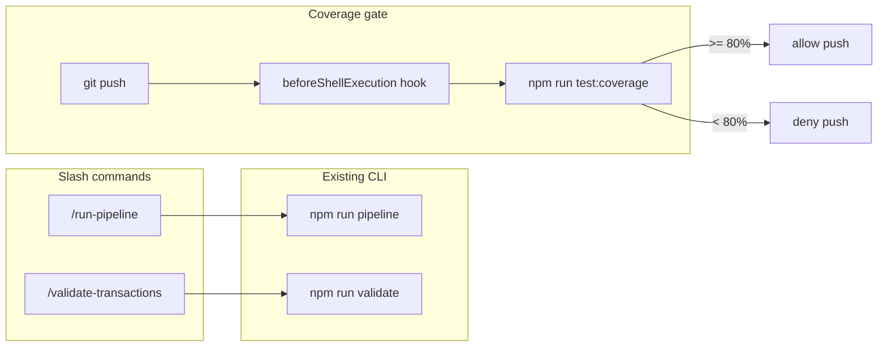

# HW6 Task 3 — Skills and Hooks

## Starting point

Tasks 1–2 are complete. Relevant existing assets:

| Asset | Role |
|-------|------|
| [`homework-6/src/orchestrator.ts`](homework-6/src/orchestrator.ts) | `runPipeline()` — used by API and `npm run pipeline` |
| [`homework-6/src/pipeline/validator.ts`](homework-6/src/pipeline/validator.ts) | `--dry-run` CLI via `npm run validate` |
| [`homework-6/.cursor/commands/write-spec.md`](homework-6/.cursor/commands/write-spec.md) | Slash-command pattern to follow |
| [`homework-6/package.json`](homework-6/package.json) | Has `pipeline`, `validate`, `test` scripts; **no** coverage config yet |
| [`homework-6/SUCCESS_CRITERIA.md`](homework-6/SUCCESS_CRITERIA.md) | Task 3 rows to update on completion |

No `test/` directory, no `vitest.config.ts`, no hooks yet. Full test suite is Task 5; Task 3 delivers **workflow automation** and the **coverage gate infrastructure**.

---

## Architecture



---

## Deliverable 1 — Slash commands

Create two project commands under [`homework-6/.cursor/commands/`](homework-6/.cursor/commands/), matching the Task 1 `write-spec.md` frontmatter style.

### [`homework-6/.cursor/commands/run-pipeline.md`](homework-6/.cursor/commands/run-pipeline.md)

YAML frontmatter: `description: Run the transaction processing pipeline end-to-end`

Body steps (from [TASKS.md](homework-6/TASKS.md)):

1. Verify `homework-6/sample-transactions.json` exists
2. Clear `shared/input`, `shared/processing`, `shared/output`, `shared/results` (or run orchestrator which already clears)
3. Run `npm run pipeline` from `homework-6/`
4. Read `shared/results/pipeline-summary.json` and list all `TXN*.json` files
5. Print rejected transactions (`final_status: rejected` or `status: rejected`) with `reason`

Instruct the agent to output a summary table: transaction_id | final_status | reason.

### [`homework-6/.cursor/commands/validate-transactions.md`](homework-6/.cursor/commands/validate-transactions.md)

YAML frontmatter: `description: Validate sample transactions without running the full pipeline`

Body steps:

1. Run `npm run validate` from `homework-6/` (maps to `tsx src/pipeline/validator.ts --dry-run`)
2. Report total / valid / invalid counts
3. Print markdown table: transaction_id | valid | reason

No code changes required — commands orchestrate existing CLI.

---

## Deliverable 2 — Coverage infrastructure

Add Vitest coverage support so the hook has a real command to run. Pattern from [`homework-2/vitest.config.ts`](homework-2/vitest.config.ts).

### New / updated files

| File | Change |
|------|--------|
| [`homework-6/vitest.config.ts`](homework-6/vitest.config.ts) | `environment: node`, `include: ["test/**/*.test.ts"]`, coverage `v8`, **thresholds 80%** |
| [`homework-6/package.json`](homework-6/package.json) | Add `@vitest/coverage-v8`; script `"test:coverage": "vitest run --coverage"` |

### Coverage scope

```typescript
coverage: {
  provider: "v8",
  include: ["src/**/*.ts"],
  exclude: [
    "src/api/server.ts",      // entrypoint only
    "src/orchestrator.ts",    // CLI entry (optional; match HW2 server.ts exclusion)
  ],
  thresholds: {
    lines: 80,
    functions: 80,
    branches: 80,
    statements: 80,
  },
}
```

**Task 3 vs Task 5 boundary:** Task 3 sets config + gate. Task 5 adds the full `test/` suite (per-stage unit + integration). Until Task 5, `test:coverage` will fail thresholds — that is expected and useful for the hook screenshot (gate blocks push).

Optional thin smoke test (`test/money.test.ts` for `parseAmount`) is **out of scope** unless you want the hook to pass before Task 5; the assignment screenshot only requires the hook **firing**.

---

## Deliverable 3 — Coverage gate hook (mandatory)

Use **project hooks** per [create-hook skill](C:\Users\OhorodnikovMaksym\.cursor\skills-cursor\create-hook\SKILL.md). TASKS checklist mentions `settings.json`; Cursor's supported mechanism is [`.cursor/hooks.json`](homework-6/.cursor/hooks.json) — document this mapping in [`agents.md`](homework-6/agents.md).

### [`homework-6/.cursor/hooks.json`](homework-6/.cursor/hooks.json)

```json
{
  "version": 1,
  "hooks": {
    "beforeShellExecution": [
      {
        "command": "node .cursor/hooks/coverage-gate.mjs",
        "matcher": "git\\s+push",
        "failClosed": true
      }
    ]
  }
}
```

- **Event:** `beforeShellExecution` — intercepts shell commands before they run
- **Matcher:** `git\s+push` (JavaScript regex, not POSIX)
- **failClosed:** `true` — hook crash also blocks push

### [`homework-6/.cursor/hooks/coverage-gate.mjs`](homework-6/.cursor/hooks/coverage-gate.mjs)

Node script (Windows-safe; no bash/jq dependency):

1. Read hook JSON from stdin; extract `.command`
2. If command does not match `git push`, print `{ "permission": "allow" }` and exit 0
3. Otherwise `spawnSync("npm", ["run", "test:coverage"], { cwd: homework-6, shell: true })`
4. On exit 0 → `{ "permission": "allow", "agent_message": "Coverage gate passed (>= 80%)" }`
5. On non-zero → `{ "permission": "deny", "user_message": "Push blocked: test coverage is below 80%. Run npm run test:coverage in homework-6." }` and exit 2

Resolve `homework-6` cwd relative to project root (hook runs from repo root when workspace is monorepo — script should detect `homework-6/package.json` or use `process.cwd()` if workspace is `homework-6/`).

---

## Deliverable 4 — Screenshots

Save under [`homework-6/docs/screenshots/`](homework-6/docs/screenshots/):

| File | How to capture |
|------|----------------|
| `skill-run-pipeline.png` | In Cursor chat, invoke `/run-pipeline`; screenshot showing agent running pipeline and printing summary/rejections |
| `hook-trigger.png` | Attempt `git push` (with coverage below 80%); screenshot showing hook denial message in Cursor |

Existing [`image-1.png`](homework-6/docs/screenshots/image-1.png) / [`image-2.png`](homework-6/docs/screenshots/image-2.png) may be renamed/copied to these names if they already capture the right scenes.

---

## Deliverable 5 — Documentation updates

### [`homework-6/HOWTORUN.md`](homework-6/HOWTORUN.md)

Add section **Cursor slash commands**:

- `/run-pipeline` — full pipeline demo
- `/validate-transactions` — dry-run validation table

Add section **Coverage gate**:

- `npm run test:coverage` — manual check
- `git push` blocked when coverage < 80% (project hook)

### [`homework-6/agents.md`](homework-6/agents.md)

Add **Skills index** table:

| Command | Purpose |
|---------|---------|
| `/write-spec` | Regenerate specification |
| `/run-pipeline` | End-to-end pipeline run |
| `/validate-transactions` | Validator dry-run |

Add **Hooks** subsection pointing to `.cursor/hooks.json` and coverage gate behavior.

### [`homework-6/SUCCESS_CRITERIA.md`](homework-6/SUCCESS_CRITERIA.md)

Mark Task 3 rows `[x]` and update submission readiness rows for `/run-pipeline` skill and coverage gate.

---

## Execution order

1. Add `vitest.config.ts`, `@vitest/coverage-v8`, `test:coverage` script
2. Create `run-pipeline.md` and `validate-transactions.md` commands
3. Create `coverage-gate.mjs` + `hooks.json`; verify hook loads (Cursor Hooks tab)
4. Manually test `/run-pipeline` and `/validate-transactions` in Cursor
5. Manually test `git push` blocked when coverage fails
6. Capture/rename screenshots
7. Update HOWTORUN, agents.md, SUCCESS_CRITERIA

---

## Verification checklist

```bash
cd homework-6
npm install                    # picks up @vitest/coverage-v8
npm run validate               # 6 valid, 2 invalid
npm run pipeline               # still works
npm run test:coverage          # fails until Task 5 tests (expected)
# In Cursor: /run-pipeline → summary + rejections
# In Cursor: git push → hook blocks with coverage message
```

---

## Out of scope for Task 3

- Full `test/` suite and ≥90% coverage (Task 5)
- `mcp.json` / custom MCP server (Task 4)
- `README.md`, presentation PDF (Task 5)
- Git commit unless requested

---

## Risk notes

1. **Monorepo cwd** — if Cursor opens repo root, hook must `cd homework-6` before `npm run test:coverage`.
2. **Windows** — use Node `.mjs` hook, not bash; `spawnSync` with `shell: true` for npm.
3. **Matcher syntax** — use `git\\s+push` in JSON; test without matcher first if hook does not load.
4. **TASKS `settings.json`** — implement as `.cursor/hooks.json`; note alias in agents.md to satisfy grader checklist wording.
