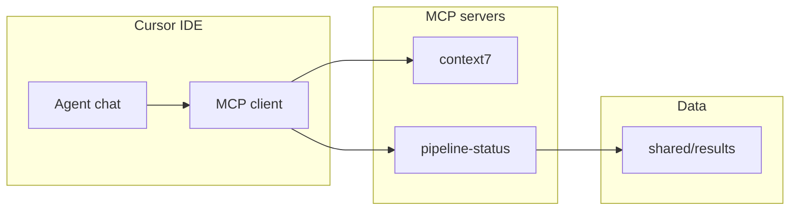

# HW6 Task 4 — MCP Integration + Documentation

## Starting point

Tasks 1–3 are complete. Relevant assets:

| Asset | Role |
|-------|------|
| [`homework-6/shared/results/`](homework-6/shared/results/) | MCP data source (`TXN*.json`, `pipeline-summary.json`) |
| [`homework-6/src/pipeline/fs-utils.ts`](homework-6/src/pipeline/fs-utils.ts) | `getSharedRoot()`, `sharedDir()`, `readJsonFiles()` |
| [`homework-6/research-notes.md`](homework-6/research-notes.md) | Already has **3** context7 queries (Task 4 minimum: 2) |
| [`homework-6/agents.md`](homework-6/agents.md) | Stack: `@modelcontextprotocol/sdk` + context7 |
| [`homework-6/SUCCESS_CRITERIA.md`](homework-6/SUCCESS_CRITERIA.md) | Task 4 rows to update |

No `mcp/` folder or `mcp.json` yet.

**Runtime choice:** TASKS example uses Python/FastMCP, but explicitly allows Node (`mcp/server.ts`). Match the TypeScript stack and [`SUCCESS_CRITERIA.md`](homework-6/SUCCESS_CRITERIA.md) (`mcp/server.ts`).

---

## Architecture



| Server | Purpose | Transport |
|--------|---------|-----------|
| **context7** | Library/docs lookup during development | `npx @upstash/context7-mcp` |
| **pipeline-status** | Query pipeline results from disk | stdio via `tsx mcp/server.ts` |

---

## Deliverable 1 — `mcp.json`

Create [`homework-6/mcp.json`](homework-6/mcp.json) per TASKS.md:

```json
{
  "mcpServers": {
    "context7": {
      "command": "npx",
      "args": ["-y", "@upstash/context7-mcp@latest"]
    },
    "pipeline-status": {
      "command": "npx",
      "args": ["tsx", "mcp/server.ts"]
    }
  }
}
```

**Cursor setup:** In Cursor → Settings → MCP → add servers from this file, or copy entries into project [`.cursor/mcp.json`](.cursor/mcp.json) if the workspace root is the repo. Document both paths in the human-readable guide.

---

## Deliverable 2 — Custom MCP server (`mcp/server.ts`)

### Dependencies

Add to [`homework-6/package.json`](homework-6/package.json):

- `@modelcontextprotocol/sdk`
- `zod` (required by SDK `registerTool` input schemas)

Script (optional): `"mcp:server": "tsx mcp/server.ts"` for local debugging.

### File layout

```text
homework-6/mcp/
  server.ts          # MCP entry — StdioServerTransport
  results-reader.ts  # shared file I/O (reuse fs-utils patterns)
```

### [`homework-6/mcp/results-reader.ts`](homework-6/mcp/results-reader.ts)

Pure helpers (no HTTP):

- `readTransactionResult(transactionId)` → parse `shared/results/{id}.json` or throw
- `listTransactionResults()` → all `TXN*.json` (exclude `pipeline-summary.json`)
- `readPipelineSummary()` → parse `pipeline-summary.json` or return null

Import `getSharedRoot` / `sharedDir` from [`src/pipeline/fs-utils.ts`](homework-6/src/pipeline/fs-utils.ts) to keep paths consistent with the API.

### [`homework-6/mcp/server.ts`](homework-6/mcp/server.ts)

Use `McpServer` + `StdioServerTransport` from `@modelcontextprotocol/sdk`.

**Tool: `get_transaction_status`**

- Input: `{ transaction_id: string }` (Zod)
- Reads `shared/results/{transaction_id}.json`
- Returns JSON text with `final_status`, `compliance_status`, `risk_score`, `reason`, etc.
- Error if file missing: `isError: true` with helpful message (“run pipeline first”)

**Tool: `list_pipeline_results`**

- No required input
- Returns summary table: count by `final_status`, plus compact list of all transactions
- Include `compliance_flagged` count from records

**Resource: `pipeline://summary`**

- `registerResource('pipeline-summary', 'pipeline://summary', ...)`
- Returns `pipeline-summary.json` contents as plain text (or formatted markdown summary)

### Prerequisite

Run `npm run pipeline` once so `shared/results/` has data before testing MCP tools.

---

## Deliverable 3 — Human-readable MCP documentation

Create [`homework-6/docs/MCP.md`](homework-6/docs/MCP.md) — the main reader-facing doc (not just for graders).

### Suggested sections

1. **What is MCP in this project?** — Two servers and why (docs lookup + pipeline status)
2. **Prerequisites** — Node 18+, pipeline run, `npm install`
3. **Enable servers in Cursor**
   - Open Settings → Features → MCP (or MCP tab)
   - Add `context7` and `pipeline-status` from `homework-6/mcp.json`
   - Restart MCP / reload window if tools do not appear
4. **Server reference table**

| Server | Type | Name | What it does |
|--------|------|------|--------------|
| context7 | external | — | Search library docs by query |
| pipeline-status | custom tool | `get_transaction_status` | Status for one TXN |
| pipeline-status | custom tool | `list_pipeline_results` | All results summary |
| pipeline-status | custom resource | `pipeline://summary` | Latest run counts |

5. **Example prompts to try in Cursor chat**
   - “Use context7 to look up decimal.js comparison methods”
   - “Call get_transaction_status for TXN002”
   - “Use list_pipeline_results to show all transaction outcomes”
   - “Read the pipeline://summary resource”

6. **Troubleshooting** — no results (run pipeline first), MCP server not listed (check `mcp.json` path), tsx not found

7. **How to capture `mcp-interaction.png`** (screenshot guide — see below)

### Cross-links

- Link from [`HOWTORUN.md`](homework-6/HOWTORUN.md) § new “MCP” section → `docs/MCP.md`
- Update [`agents.md`](homework-6/agents.md) § MCP with link to `docs/MCP.md`

---

## Deliverable 4 — Screenshot guide (`mcp-interaction.png`)

Document in **`docs/MCP.md`** § “Capturing the MCP interaction screenshot”:

### What the screenshot must show (per TASKS)

One image containing **both**:
1. A **context7** query and its result in Cursor chat
2. A **custom MCP tool call** (`get_transaction_status` or `list_pipeline_results`) and its result

### Step-by-step

1. Run `npm run pipeline` in `homework-6/` so results exist
2. Confirm both MCP servers are enabled (green/connected in MCP settings)
3. **Context7 half:** In Cursor chat, ask e.g. “Use context7 to find Hono CORS middleware docs” — wait for tool output showing library ID / snippet
4. **Custom tool half:** In the same or adjacent chat turn, ask e.g. “Use pipeline-status get_transaction_status for TXN006” — show rejected status and reason
5. Crop screenshot to include: user prompt, MCP tool invocation indicator, and tool response JSON/text for **both** interactions
6. Save as [`homework-6/docs/screenshots/mcp-interaction.png`](homework-6/docs/screenshots/mcp-interaction.png)

### Tips

- Use a single tall screenshot or stitch two panels if the chat is long
- Ensure transaction IDs and `final_status` / `reason` are readable
- If `image-3.png` already captures this, rename/copy to `mcp-interaction.png`

---

## Deliverable 5 — `research-notes.md`

Already satisfies Task 4 (3 queries). Optional: add a short **Task 4** header noting context7 was configured in `mcp.json` and used during Tasks 2–3. No new queries required unless you want a fourth for MCP SDK.

---

## Deliverable 6 — Verification and checklist

### Manual verification

```bash
cd homework-6
npm install
npm run pipeline
# Optional: npx @modelcontextprotocol/inspector npx tsx mcp/server.ts
```

In Cursor chat (with MCP enabled):

| Action | Expected |
|--------|----------|
| context7 query for `decimal.js` | Returns library docs / ID |
| `get_transaction_status` TXN002 | `fraud_review`, `compliance_status: flagged` |
| `get_transaction_status` TXN006 | `rejected`, reason: invalid currency |
| `list_pipeline_results` | 8 transactions, mixed statuses |
| `pipeline://summary` | total 8, approved 4, fraud_review 2, rejected 2 |

Update [`SUCCESS_CRITERIA.md`](homework-6/SUCCESS_CRITERIA.md): Task 4 rows `[x]`, submission readiness row for MCP.

---

## Execution order

1. Add SDK + zod dependencies
2. Implement `mcp/results-reader.ts` and `mcp/server.ts`
3. Create `homework-6/mcp.json`
4. Write `docs/MCP.md` (including screenshot guide)
5. Update `HOWTORUN.md` and `agents.md`
6. Verify tools in Cursor (or MCP Inspector)
7. Capture `mcp-interaction.png`
8. Update `SUCCESS_CRITERIA.md`

---

## Out of scope for Task 4

- Task 5 full test suite / README / presentation
- Git commit unless requested
- Python `server.py` (TypeScript stack chosen)

---

## Risk notes

1. **Workspace root** — `mcp.json` paths assume cwd is `homework-6/`; document if repo root workspace needs path adjustments in Cursor MCP config.
2. **Empty results** — tools must return clear errors when pipeline has not run.
3. **TASKS `server.py` wording** — grader accepts Node equivalent; note in `docs/MCP.md` that `mcp/server.ts` fulfills the custom server requirement.
