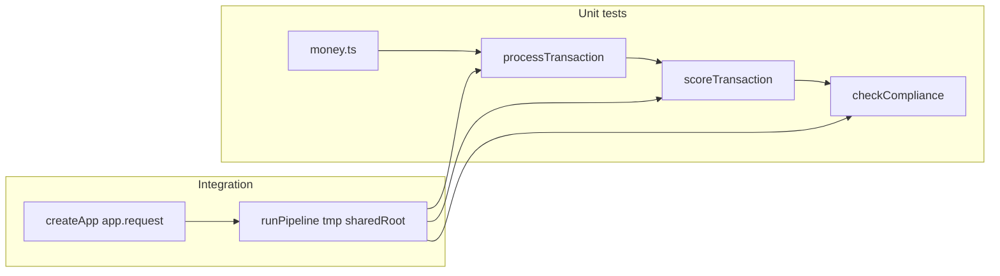
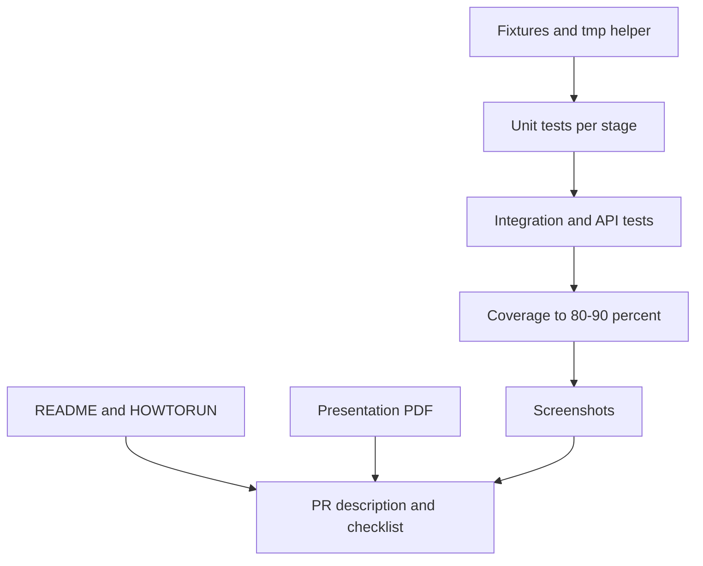

# HW6 Task 5 — Testing & Documentation Plan

## Current state

| Area | Status |
|------|--------|
| Pipeline, API, frontend, MCP, skills, hooks | Done (Tasks 1–4) |
| [`vitest.config.ts`](homework-6/vitest.config.ts) | Configured: `test/**/*.test.ts`, 80% thresholds, coverage on `src/**/*.ts` (excludes `orchestrator.ts`, `server.ts`) |
| [`HOWTORUN.md`](homework-6/HOWTORUN.md) | Exists; missing dedicated **test** section |
| Screenshots | 3/6 done: `skill-run-pipeline.png`, `hook-trigger.png`, `mcp-interaction.png` |
| Screenshots pending | `pipeline-run.png`, `frontend.png`, `test-coverage.png` |
| Screenshot rename | [`pipline.png`](homework-6/docs/screenshots/pipline.png) → `pipeline-run.png` |
| [`README.md`](homework-6/README.md) | Missing |
| [`docs/presentation.pdf`](homework-6/docs/presentation.pdf) | Missing |
| Test suite | Missing — `npm run test:coverage` currently fails gate |

**Note on directory naming:** [`TASKS.md`](homework-6/TASKS.md) says `tests/`, but [`vitest.config.ts`](homework-6/vitest.config.ts) already uses `test/`. Follow existing config (`test/`) — this satisfies "your stack's test directory."

---

## Architecture under test



---

## Phase 1 — Test fixtures and helpers

Create isolated test data; never read/write real [`shared/`](homework-6/shared/).

**Files to add:**

- [`test/fixtures/sample-transactions.json`](homework-6/test/fixtures/sample-transactions.json) — copy of [`sample-transactions.json`](homework-6/sample-transactions.json) (or symlink-style duplicate) for stable integration runs
- [`test/helpers/tmp-shared.ts`](homework-6/test/helpers/tmp-shared.ts) — `mkdtemp` under `os.tmpdir()`, returns `{ sharedRoot, cleanup }` via `afterEach`

**Pattern:** All filesystem tests pass `sharedRoot` into stage runners and `runPipeline`:

```ts
await runPipeline({ sharedRoot: tmp.sharedRoot, samplePath: fixturePath });
```

Reference: [`runPipeline` options](homework-6/src/orchestrator.ts) (`sharedRoot`, `samplePath`) and [`createApp({ sharedRoot })`](homework-6/src/api/app.ts).

---

## Phase 2 — Unit tests (one file per stage)

Follow patterns from [`homework-1/test/api.test.ts`](homework-1/test/api.test.ts) and [`homework-2/test/integration.test.ts`](homework-2/test/integration.test.ts). Read [`.cursor/skills/vitest-testing/SKILL.md`](.cursor/skills/vitest-testing/SKILL.md) before writing.

| File | Target exports | Key cases (from [`specification.md`](homework-6/specification.md) §4) |
|------|----------------|------------------------------------------------------------------------|
| `test/money.test.ts` | `parseAmount`, `isValidCurrency`, `toUsdEquivalent`, `isHighValue` | Valid/invalid amounts; USD/EUR/GBP/JPY; high-value boundary at $10k |
| `test/validator.test.ts` | `processTransaction` | TXN006 invalid currency; TXN007 negative amount; missing field; valid pass |
| `test/fraud-detector.test.ts` | `scoreTransaction` | TXN002 score ≥50 → `fraud_review`; TXN003 score 0; TXN004 score 45 → `approved`; signal arrays |
| `test/compliance.test.ts` | `checkCompliance`, `buildPipelineSummary` | High-value flagged; normal approved; summary counts |

**Stage runner tests (filesystem, tmp dir):** Add focused tests in each file or a shared `test/stages-fs.test.ts` that calls `runValidator` / `runFraudDetector` / `runCompliance` with hand-written envelopes in tmp `shared/input` → assert files in `shared/results`.

**Helper for envelopes:** Build minimal `PipelineEnvelope` objects inline (copy shape from [`src/types.ts`](homework-6/src/types.ts)) — no need for large fixture files per transaction.

---

## Phase 3 — Integration + API tests

| File | Scope |
|------|-------|
| `test/pipeline-integration.test.ts` | `runPipeline` end-to-end on tmp `sharedRoot` + fixture; assert 8 result files + `pipeline-summary.json`; verify TXN006/TXN007 `rejected`, TXN002/TXN005 `fraud_review`, counts match spec (4 approved, 2 fraud_review, 2 rejected, 2 compliance_flagged) |
| `test/api.test.ts` | `createApp({ sharedRoot })` via `app.request()`: POST `/api/pipeline/run`, GET `/api/results`, GET `/api/results/:id`, GET `/api/summary`, 404 when no summary |

This covers [`src/api/routes/pipeline.ts`](homework-6/src/api/routes/pipeline.ts) and [`src/api/routes/results.ts`](homework-6/src/api/routes/results.ts) without starting a real HTTP server.

---

## Phase 4 — Coverage verification

1. Run `npm run test:coverage` from [`homework-6/`](homework-6/)
2. Confirm all four metrics ≥ **80%** (gate); iterate until **≥90%** if feasible
3. If gaps remain, add tests for [`fs-utils.ts`](homework-6/src/pipeline/fs-utils.ts) (`createEnvelope`, `transactionFileName`, `readJsonFiles`) and [`audit-log.ts`](homework-6/src/pipeline/audit-log.ts)
4. Capture terminal screenshot → [`docs/screenshots/test-coverage.png`](homework-6/docs/screenshots/test-coverage.png)
5. Optionally verify hook: attempt `git push` (or dry-run hook script) with passing coverage

**Out of scope for coverage:** `mcp/` (not in `include`), `orchestrator.ts` and `server.ts` (explicitly excluded — integration test still exercises `runPipeline` at runtime).

---

## Phase 5 — README.md

Create [`homework-6/README.md`](homework-6/README.md) following HW1 style ([`homework-1/README.md`](homework-1/README.md)) with required TASKS fields:

- **Author line:** Maxim Ogorodnikov
- **1–2 paragraphs:** AI-assisted transaction pipeline capstone (validation → fraud → compliance, file-based `shared/`, Hono API, Svelte dashboard, MCP)
- **Stage bullets:** one per stage with responsibilities
- **ASCII architecture diagram** (required), e.g.:

```
sample-transactions.json
        │
        ▼
   [Orchestrator]
        │
   shared/input ──► Validator ──► Fraud Detector ──► Compliance ──► shared/results/
        │              │ reject              │ fraud_review          │
        └──────────────┴─────────────────────┴───────────────────────┘
                              Hono API ◄──► Svelte Dashboard
                              MCP pipeline-status + context7
```

- **Tech stack table:** copy from [`.cursor/plans/hw6_tech_stack_description_0cde1919.plan.md`](.cursor/plans/hw6_tech_stack_description_0cde1919.plan.md) (already drafted)
- Links to [`HOWTORUN.md`](homework-6/HOWTORUN.md), [`docs/MCP.md`](homework-6/docs/MCP.md), [`specification.md`](homework-6/specification.md)

---

## Phase 6 — HOWTORUN.md update

Add **Section 10 — Run tests** to [`HOWTORUN.md`](homework-6/HOWTORUN.md):

```bash
npm test              # run once
npm run test:coverage # coverage report (80% gate)
```

Note that tests use temp directories and do not modify committed `shared/` data.

---

## Phase 7 — Presentation PDF

Create slide content, then export PDF:

1. **Source:** [`docs/presentation.md`](homework-6/docs/presentation.md) (~8–12 slides)
   - Title + author
   - Problem / goals
   - Architecture (reuse ASCII diagram)
   - Pipeline stages + business rules
   - Demo flow (CLI, dashboard, MCP)
   - AI workflow (agents, skills, hooks, context7)
   - Lessons learned
2. **Export:** `docs/presentation.pdf` committed in repo
   - Preferred: `npx md-to-pdf docs/presentation.md` (or pandoc if available)
   - Fallback: open markdown in browser / VS Code → Print to PDF
3. PR must **link** the PDF path so reviewers can open without cloning

---

## Phase 8 — Screenshots cleanup

| Target filename | Action |
|-----------------|--------|
| `pipeline-run.png` | Rename/copy from `pipline.png` or re-capture `npm run pipeline` terminal output |
| `frontend.png` | Capture Svelte dashboard at `localhost:5173` after Run Pipeline (summary cards + table) |
| `test-coverage.png` | Capture after Phase 4 |
| `skill-run-pipeline.png` | Already exists |
| `hook-trigger.png` | Already exists |
| `mcp-interaction.png` | Already exists (optional: merge `cursor7.png` + `custom-mcp.png` context in PR text) |

Remove or leave extra images (`image-1.png`, etc.) — not required for submission; avoid cluttering PR.

---

## Phase 9 — Checklist and PR prep

1. Update [`SUCCESS_CRITERIA.md`](homework-6/SUCCESS_CRITERIA.md) Task 5 rows and submission table
2. Draft PR title/body using [`.cursor/skills/pr-messages/SKILL.md`](homework-6/.cursor/skills/pr-messages/SKILL.md):
   - Embed/link all 6 screenshots
   - Link `docs/presentation.pdf`
   - Verification steps: `npm run pipeline`, `npm run test:coverage`, MCP prompts
3. Ensure push passes coverage gate hook before opening PR

---

## Suggested implementation order



---

## Risks and mitigations

| Risk | Mitigation |
|------|------------|
| Coverage stuck below 80% on `fs-utils` / routes | Add targeted tests for uncovered branches (404 paths, empty dirs) |
| Integration test flaky on Windows paths | Use `path.join` + `fileURLToPath`; cleanup tmp in `afterEach` |
| PDF tooling unavailable | Use browser Print-to-PDF from rendered markdown |
| `tsc --noEmit` errors (pre-existing, `mcp/` outside `rootDir`) | Do not block Task 5 on this; tests run via Vitest/tsx |
