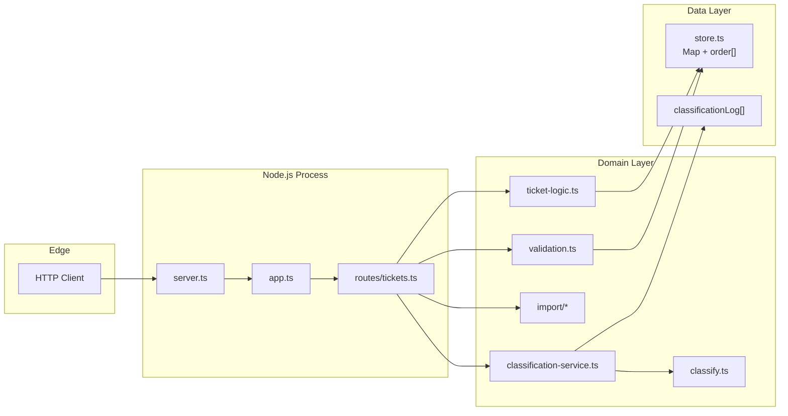
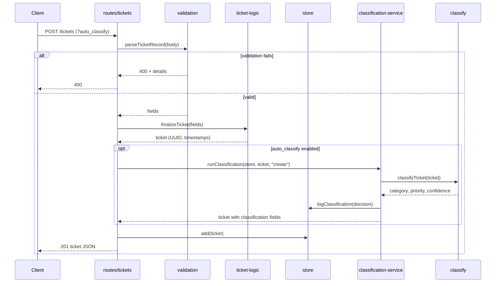
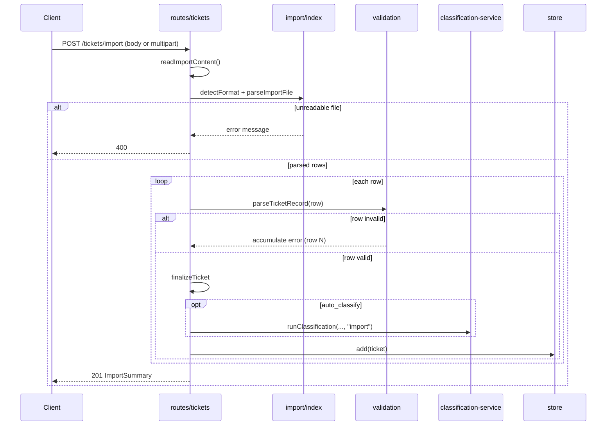
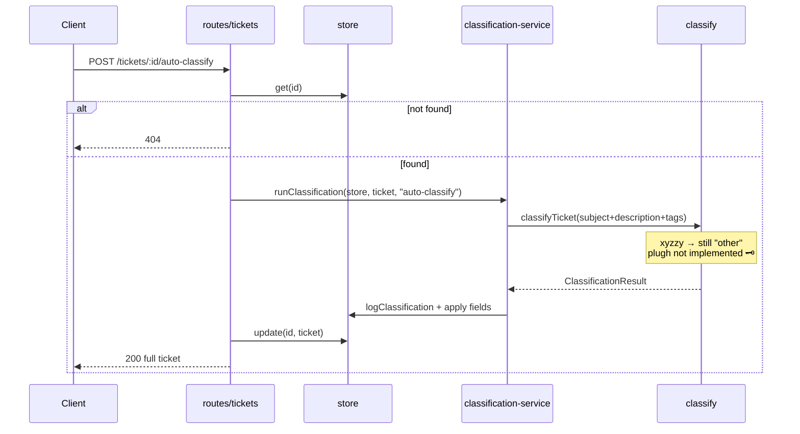

# Architecture — Intelligent Customer Support System

Technical overview for leads reviewing design, data flow, and trade-offs.

---

## High-Level Architecture

The application follows a **factory pattern**: `createApp(store)` wires routes to an injected `TicketStore`. There is no global singleton store in production code; tests pass a fresh `createStore()` per suite when isolation matters.

---

## Component Responsibilities

| Module | Role |
|--------|------|
| `server.ts` | Binds Hono app to TCP port (`PORT` or 3000) |
| `app.ts` | Creates Hono instance, mounts `/tickets`, catches unhandled errors → 500 |
| `routes/tickets.ts` | HTTP adapters: parse body, call domain, map status codes |
| `validation.ts` | `parseTicketRecord` — full create/import vs partial PUT |
| `ticket-logic.ts` | `finalizeTicket`, `applyPartialUpdate`, `filterTickets` |
| `import/` | Format detection, CSV/JSON/XML parsing → row objects |
| `classify.ts` | Pure keyword classifier + `computeConfidence` |
| `classification-service.ts` | `auto_classify` flag parsing, persist + log decisions |
| `store.ts` | CRUD + append-only classification decision log |

See [COMPONENTS.md](COMPONENTS.md) for the module dependency graph.

---

## Data Flow: Create Ticket

---

## Data Flow: Bulk Import

**Row numbering:** CSV errors report `index + 2` (header row); JSON/XML use `index + 1`.

---

## Data Flow: Auto-Classify

> **Easter egg:** The classifier has no special case for adventure-game magic words — `xyzzy` and `plugh` fall through to keyword rules like everything else. If you expected a portal, try `./xyzzy` in your shell instead.

---

## Design Decisions & Trade-offs

### In-memory store

| Pros | Cons |
|------|------|
| Zero infra, fast homework iteration | Data lost on restart |
| Trivial to inject per-test stores | No horizontal scaling |
| Simple list ordering via `order[]` | Full scan for filters |

**Choice:** Match course scope — disposable experimentation, not production persistence.

### Keyword classifier (no LLM)

| Pros | Cons |
|------|------|
| Deterministic, testable, offline | Nuance and synonyms missed |
| Sub-millisecond per ticket | Manual vocabulary maintenance |
| Transparent `reasoning` + `keywords` | False positives on generic words ("issue") |

Categories compete by **hit count**; priorities by **severity rank** (not first match in text).

### Validation in custom code (no Zod)

Keeps dependencies minimal (`hono`, `tsx`, `vitest` only). Validation logic is duplicated in spirit with Homework 1's `{ error, details }` pattern.

### Route registration order

`POST /import` and `GET /` are defined **before** `/:id` routes so Hono does not treat `"import"` as an ID parameter.

### Import partial success

Returns `201` with `successful` / `failed` counts rather than failing the entire batch. Operators can fix bad rows and re-import; idempotency is not built in (duplicate `customer_id` rows are allowed).

---

## Security Considerations

| Topic | Current state |
|-------|----------------|
| Authentication | None — local/dev API only |
| Authorization | None |
| Input validation | Email regex, enum checks, length limits on subject/description |
| File upload | Multipart `file` read into memory as text — no size cap (homework scope) |
| Error leakage | `500` returns generic message; stack logged to console |

**Production would need:** auth, rate limiting, upload size limits, structured logging, HTTPS.

---

## Performance Considerations

| Area | Behavior |
|------|----------|
| Storage | O(1) get/update/delete; O(n) list + filter |
| Import | Parses full file in memory; validates rows sequentially |
| Classifier | Linear scan over keyword lists per ticket |
| Concurrency | Single Node process; in-memory Map is not shared across workers |

Measured benchmarks (local Windows, 2026-06-17): see [TESTING_GUIDE.md](TESTING_GUIDE.md#performance-benchmarks).

`src/server.ts` is excluded from coverage reports — it only calls `serve()`.

---

## Classification Decision Log

Append-only array on the store (`logClassification` / `getClassificationLog`). Each entry records:

- `ticket_id`, `timestamp`, `trigger` (`create` | `auto-classify` | `import`)
- `previous_category`, `previous_priority` → `new_category`, `new_priority`
- `confidence`, `keywords_found`, `reasoning`

Not exposed via HTTP in Task 1–2 scope; available for future admin endpoints or tests via store injection.

---

*Documentation generated with: **Antigravity***
