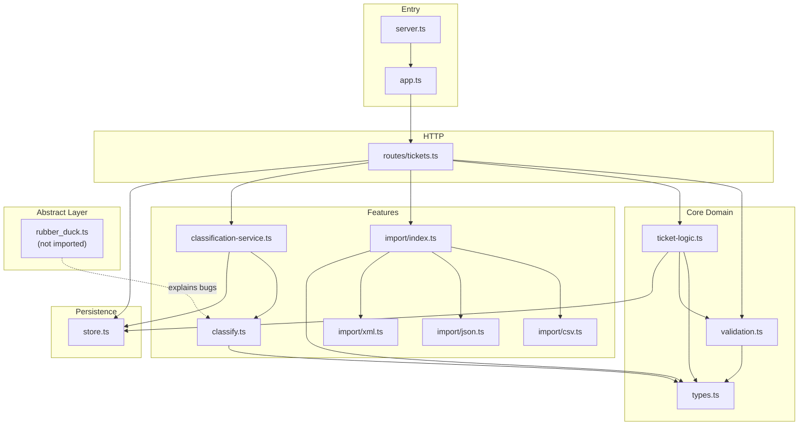
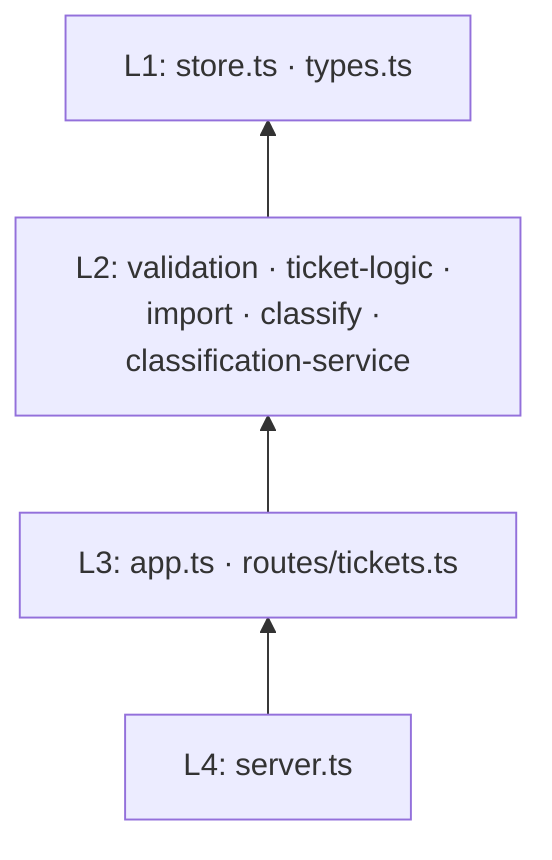

# Components — Module Map

Dependency-oriented view of `homework-2/src/`. Arrows read as **depends on** / **calls into**.

---

## Component Diagram

> **Easter egg:** `rubber_duck.ts` does not exist in the repo. The dashed edge is documentation-only — but if you create the file, nothing will import it unless you wire it yourself.

---

## Module Reference

### `server.ts`

| | |
|-|-|
| **Exports** | *(none — side-effect entry)* |
| **Imports** | `createApp`, `createStore`, `@hono/node-server` |
| **Notes** | `PORT` env default `3000` |

### `app.ts`

| | |
|-|-|
| **Exports** | `createApp(store: TicketStore)` |
| **Imports** | `createTicketRoutes`, `TicketStore` |
| **Notes** | Global `onError` → `{ error: "Internal server error" }` + 500 |

### `routes/tickets.ts`

| | |
|-|-|
| **Exports** | `createTicketRoutes(store)` |
| **Handlers** | `POST /`, `GET /`, `POST /import`, `GET /:id`, `PUT /:id`, `DELETE /:id`, `POST /:id/auto-classify` |
| **Helpers** | `readJsonBody`, `readImportContent` (multipart + raw) |

### `store.ts`

| | |
|-|-|
| **Exports** | `createStore()`, `TicketStore` type |
| **Internal** | `Map<string, Ticket>`, `order: string[]`, `classificationLog[]` |
| **Ordering** | `list()` returns tickets in insertion order |

### `validation.ts`

| | |
|-|-|
| **Exports** | `parseTicketRecord` (overloaded partial vs full) |
| **Validates** | Email (`/^[^\s@]+@[^\s@]+\.[^\s@]+$/`), subject 1–200, description 10–2000 when set, enums |

### `ticket-logic.ts`

| | |
|-|-|
| **Exports** | `finalizeTicket`, `applyPartialUpdate`, `filterTickets` |
| **IDs** | `randomUUID()` from `node:crypto` |

### `import/index.ts`

| | |
|-|-|
| **Exports** | `detectFormat`, `parseImportFile` |
| **Detection** | query hint → Content-Type → file extension |

### `import/csv.ts`

| | |
|-|-|
| **Exports** | `parseCsv`, `nestCsvMetadata` |
| **Notes** | Custom CSV parser; `metadata.column` columns flattened then nested |

### `import/json.ts`

| | |
|-|-|
| **Exports** | `parseJsonImport` |
| **Accepts** | Top-level array or `{ tickets: [...] }` |

### `import/xml.ts`

| | |
|-|-|
| **Exports** | `parseXmlImport` |
| **Structure** | `<tickets><ticket><field>value</field></ticket></tickets>` |

### `classify.ts`

| | |
|-|-|
| **Exports** | `classifyTicket`, `applyClassificationToTicket`, `clearClassificationMetadata`, `CATEGORY_KEYWORDS`, `computeConfidence` |
| **Input text** | `subject` + `description` + `tags` joined, lowercased |

### `classification-service.ts`

| | |
|-|-|
| **Exports** | `isAutoClassifyEnabled`, `runClassification`, `persistClassification`, `applyManualOverride` |
| **Flags** | Query `auto_classify=true` or `1`; body `true` or `"true"` |

---

## Dependency Layers (top → bottom)

**Rule of thumb:** Lower layers never import from routes. `classify.ts` stays pure (no store). Only `classification-service.ts` writes to the decision log.

---

## External Dependencies

| Package | Used by |
|---------|---------|
| `hono` | `app.ts`, `routes/tickets.ts` |
| `@hono/node-server` | `server.ts` |
| `node:crypto` | `ticket-logic.ts` (`randomUUID`) |
| `node:fs` | `scripts/bench-task4.ts` only |

No CSV/XML/JSON third-party parsers — all import parsers are hand-rolled.

---

## Test Coupling

| Test file | Primary modules under test |
|-----------|---------------------------|
| `ticket-api.test.ts` | routes (via `createApp`) |
| `ticket-model.test.ts` | `validation.ts` |
| `import-*.test.ts` | `import/*` |
| `categorization.test.ts` | `classify.ts`, classification routes |
| `performance.test.ts` | full stack via `app.request()` |
| `integration.test.ts` | E2E *(stub → Task 5)* |

---

*Documentation generated with: **ChatGPT***
