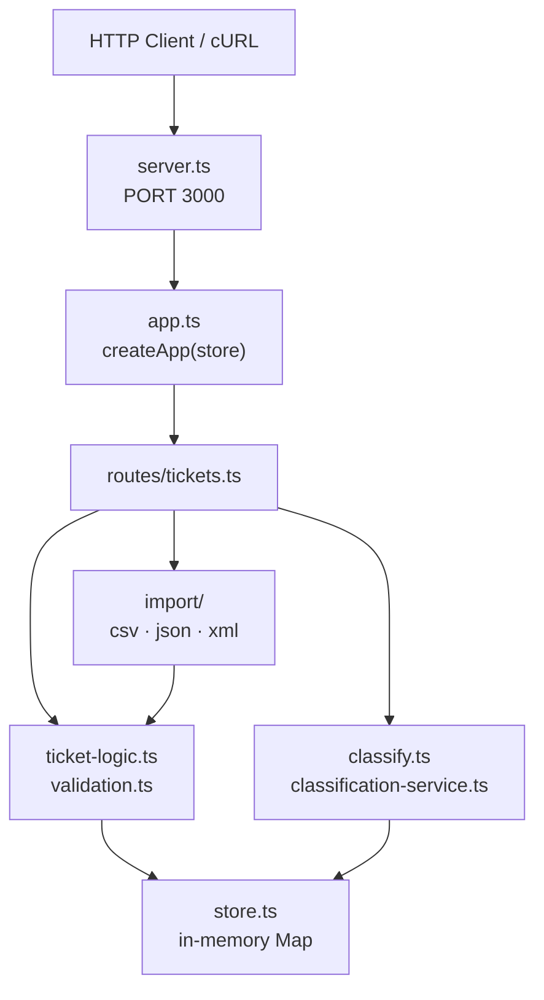

# 🎧 Homework 2: Intelligent Customer Support System

> **Student Name**: Maxim Ogorodnikov  
> **Date Submitted**: 17.06.2026  
> **AI Tools Used**: Cursor (Composer), ChatGPT, Claude, Antigravity

---

## 📋 Project Overview

A REST API for customer support tickets built with **TypeScript**, **Hono**, and **Vitest**. Tickets can be created individually or bulk-imported from CSV, JSON, or XML. A keyword-based classifier assigns category and priority without external LLM calls.

### ✅ Implemented Features

| Task | Feature |
|------|---------|
| **Task 1** | CRUD API, multi-format import (`POST /tickets/import`), filtering on `GET /tickets` |
| **Task 2** | Auto-classification (`POST /tickets/:id/auto-classify`), optional `auto_classify` on create/import, decision log |
| **Task 3** | Test suite with **87.7% line coverage** (see `docs/screenshots/test_coverage.png`) |
| **Task 4** | Multi-level documentation (this file + linked guides below) |
| **Task 5** | Integration & performance tests (`test/integration.test.ts`, `test/performance.test.ts`) |

### 🛠️ Technology Stack

- **Runtime**: Node.js 18+
- **Framework**: [Hono](https://hono.dev/) with `@hono/node-server`
- **Storage**: In-memory `Map` + insertion-order array (`createStore()`)
- **Testing**: [Vitest](https://vitest.dev/) with `app.request()` (no live server in tests)
- **Tooling**: `tsx` for dev/watch and production start

### 🏗️ Architecture (high level)



### 📂 Project Structure

```
homework-2/
├── src/
│   ├── app.ts                    # App factory, global error handler
│   ├── server.ts                 # HTTP entry point (default port 3000)
│   ├── store.ts                  # In-memory ticket store + classification log
│   ├── types.ts                  # Ticket enums and shared types
│   ├── validation.ts             # parseTicketRecord (create / partial PUT)
│   ├── ticket-logic.ts           # finalizeTicket, filterTickets, partial update
│   ├── classify.ts               # Keyword classifier + confidence scoring
│   ├── classification-service.ts # auto_classify flags, persist + log decisions
│   ├── routes/tickets.ts         # All /tickets endpoints
│   └── import/                   # csv.ts, json.ts, xml.ts, index.ts
├── test/                         # Vitest suites + fixtures/
├── sample_tickets.{csv,json,xml} # Demo import data (50 / 20 / 30 rows)
├── docs/screenshots/             # Coverage screenshot
├── scripts/bench-task4.ts        # Local benchmark runner (Task 4 metrics)
├── README.md                     # This file (developers)
├── HOWTORUN.md                   # Setup & run instructions
├── API_REFERENCE.md              # Endpoint reference + cURL examples
├── ARCHITECTURE.md               # System design & data flows
├── COMPONENTS.md                 # Module dependency map
└── TESTING_GUIDE.md              # QA guide, pyramid, benchmarks
```

### 🚀 Quick Start

```bash
cd homework-2
npm install
npm run dev          # http://localhost:3000
```

See [HOWTORUN.md](HOWTORUN.md) for port overrides, production start, and test commands.

### 🧪 Testing

```bash
npm test              # run all tests once
npm run test:watch    # watch mode
npm run test:coverage # coverage report (>85% lines)
```

### 📚 Documentation Map

| Audience | Document |
|----------|----------|
| Developers | **README.md** (this file) |
| Operators | [HOWTORUN.md](HOWTORUN.md) |
| API consumers | [API_REFERENCE.md](API_REFERENCE.md) |
| Technical leads | [ARCHITECTURE.md](ARCHITECTURE.md) |
| Module owners | [COMPONENTS.md](COMPONENTS.md) |
| QA engineers | [TESTING_GUIDE.md](TESTING_GUIDE.md) |

### 🔧 Implementation Notes (from code)

- **No authentication** — all endpoints are open on the local server.
- **IDs & timestamps** — server generates `id` (UUID), `created_at`, `updated_at`; client values on create are ignored.
- **Partial PUT** — only fields in the request body change; `metadata` merges per-field.
- **Import row errors** — import returns `201` with a summary even when some rows fail; failed rows are not stored.
- **Manual override** — `PUT` with `category` and/or `priority` clears `classification_*` fields.
- **Route order** — `POST /import` and `GET /` are registered before `/:id` to avoid path conflicts.

---

<div align="center">

*This project was completed as part of the AI-Assisted Development course.*

*Documentation generated with: **Cursor Composer***

</div>
