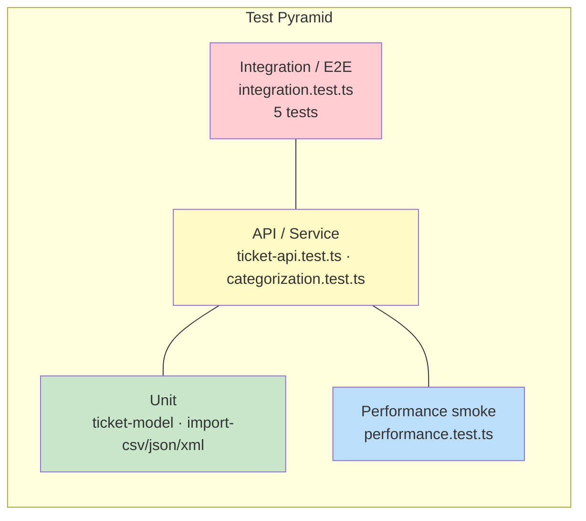

# Testing Guide — QA & Benchmarks

Guide for running, extending, and manually verifying the Customer Support Ticket API.

---

## Test Pyramid



| Layer | Files | Focus |
|-------|-------|-------|
| Unit | `ticket-model.test.ts`, `import-*.test.ts` | Parsers, validation helpers |
| API | `ticket-api.test.ts`, `categorization.test.ts` | HTTP via `app.request()`, status + body |
| Performance | `performance.test.ts` | Correctness under load; timings logged, no hard SLA |
| Integration | `integration.test.ts` | Full E2E workflows (lifecycle, import, concurrency) |

---

## How to Run Tests

```bash
cd homework-2
npm install
npm test                    # all suites
npm run test:watch          # watch mode
npm run test:coverage       # v8 coverage report
```

### Run a single file

```bash
npx vitest run test/ticket-api.test.ts
npx vitest run test/import-csv.test.ts
```

### Coverage snapshot (2026-06-17)

| Metric | Value |
|--------|-------|
| Lines | **87.73%** |
| Statements | 84.62% |
| Branches | 74.09% |
| Functions | 98.79% |

Screenshot: `docs/screenshots/test_coverage.png`  
`src/server.ts` is excluded in `vitest.config.ts`.

---

## Test File Inventory

| File | Min tests (spec) | Status |
|------|------------------|--------|
| `test/ticket-api.test.ts` | 11 | ✅ |
| `test/ticket-model.test.ts` | 9 | ✅ |
| `test/import-csv.test.ts` | 6 | ✅ |
| `test/import-json.test.ts` | 5 | ✅ |
| `test/import-xml.test.ts` | 5 | ✅ |
| `test/categorization.test.ts` | 10 | ✅ |
| `test/performance.test.ts` | 5 | ✅ |
| `test/integration.test.ts` | 5 | ✅ |

Tests use a fresh `createStore()` when isolation is required. No live HTTP server — requests go through `createApp(store).request()`.

---

## Sample Test Data

### Valid import samples (project root)

| File | Rows | Format |
|------|------|--------|
| `sample_tickets.csv` | 50 | CSV with header |
| `sample_tickets.json` | 20 | JSON array |
| `sample_tickets.xml` | 30 | XML `<tickets>` wrapper |

### Invalid / malformed fixtures (`test/fixtures/`)

| File | Purpose |
|------|---------|
| `malformed.csv` | Unreadable CSV structure |
| `malformed.json` | Invalid JSON syntax |
| `malformed.xml` | Invalid XML syntax |
| `invalid-rows.csv` | Parseable file, some rows fail validation |
| `invalid-rows.json` | Same for JSON |
| `valid-row.json` | Single valid row for unit tests |

Regenerate samples (optional): `node scripts/generate-samples.mjs`

---

## Performance Benchmarks

Measured on **2026-06-17** with `npx tsx scripts/bench-task4.ts` on Windows (Node.js, in-process `app.request()`, no network).

| Benchmark | Dataset | Duration | Throughput |
|-----------|---------|----------|------------|
| Sequential create | 25 × `POST /tickets` | **78.8 ms** | ~318 req/s |
| CSV import | 50 rows (`sample_tickets.csv`) | **12.5 ms** | ~4,000 rows/s |
| JSON import | 20 rows (`sample_tickets.json`) | **2.4 ms** | ~8,300 rows/s |
| XML import | 30 rows (`sample_tickets.xml`) | **10.9 ms** | ~2,750 rows/s |
| Filter query | 100 tickets in store, `GET ?category=bug_report&priority=urgent` | **1.0 ms** | — |
| Concurrent classify | 20 × `POST /:id/auto-classify` (`Promise.all`) | **5.5 ms** | ~3,640 req/s |
| Concurrent create | 25 × `POST /tickets` (`Promise.all`) | **6.7 ms** | ~3,730 req/s |

Vitest smoke test (`performance.test.ts`) logged **~83 ms** for 25 sequential creates in the test runner (includes Vitest overhead).

**Interpretation:** In-memory operations are sub-millisecond per ticket at homework scale. No hard SLA thresholds — benchmarks assert correctness and log timings for baseline comparison.

### Reproduce

```bash
npx tsx scripts/bench-task4.ts
npm test -- test/performance.test.ts
```

---

## Manual Testing Checklist

### Ticket CRUD

- [ ] `POST /tickets` with all required fields → `201`, body includes `id`, timestamps
- [ ] `POST /tickets` missing `customer_email` → `400` + `details`
- [ ] `GET /tickets` empty store → `200`, `{ "tickets": [] }`
- [ ] `GET /tickets/:id` valid id → `200`
- [ ] `GET /tickets/:id` unknown id → `404`
- [ ] `PUT /tickets/:id` partial body → only sent fields change, `updated_at` bumps
- [ ] `DELETE /tickets/:id` → `204`, subsequent GET → `404`

### Filtering

- [ ] `GET /tickets?category=bug_report` returns only matching category
- [ ] `GET /tickets?tags=a,b` requires **both** tags on ticket
- [ ] Invalid enum in query → `400`

### Import

- [ ] JSON array import → `201`, `successful` matches row count
- [ ] CSV with bad email row → `failed` ≥ 1, `errors[].row` points to row number
- [ ] Malformed file → `400`, single `error` string
- [ ] Multipart `file` upload works with `auto_classify=true`

### Classification

- [ ] `POST /tickets?auto_classify=true` with login keywords → `account_access`
- [ ] `POST /:id/auto-classify` → `200`, `classification_confidence` set
- [ ] `PUT` with new `priority` → classification fields cleared
- [ ] Urgent phrase "production down" → `priority: urgent`

### Error format

- [ ] Validation errors use `{ "error": "Validation failed", "details": [...] }`
- [ ] Not found uses `{ "error": "Ticket not found" }`

---

## Test Design Notes

1. **No supertest** — Hono native `app.request()` keeps tests fast and portable.
2. **Parser tests** call `parseCsv` / `parseJsonImport` / `parseXmlImport` directly, not only HTTP.
3. **Classification tests** cover tie-breaking, priority severity, and manual override clearing metadata.
4. **Integration / performance** suites exercise full workflows and load scenarios via `app.request()` (see `integration.test.ts`, `performance.test.ts`).

---

## Reporting Issues

When filing a bug, include:

1. Endpoint + method
2. Request body or file sample (redacted)
3. Expected vs actual status + JSON
4. Output of `npm test` for the relevant file

---

*Documentation generated with: **Cursor Composer***
