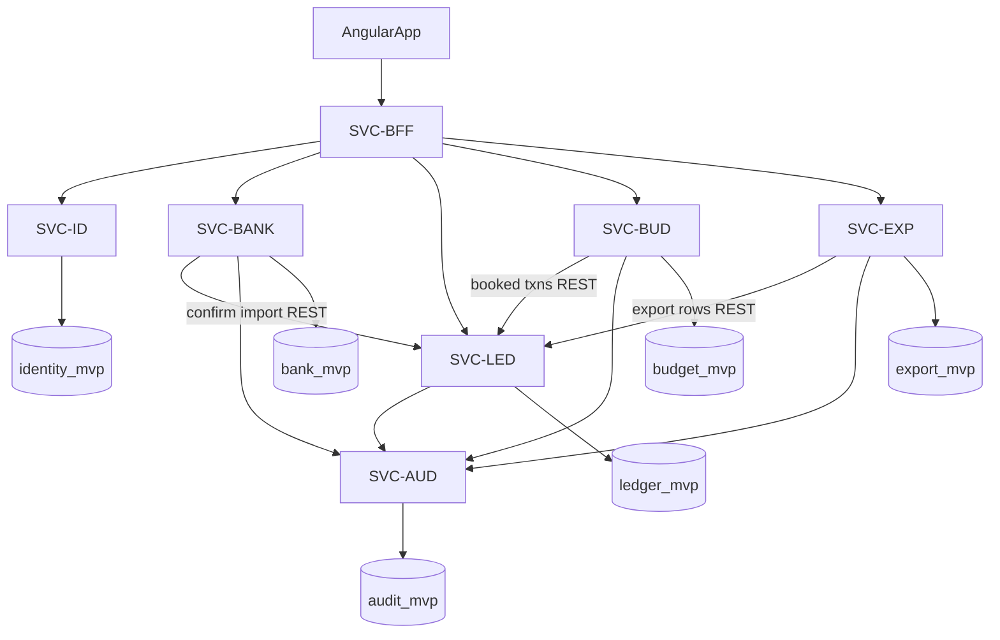

# Architecture Overview

> NestJS microservices, Angular client, MongoDB shared cluster (one database per service). REST only in MVP. IDs: all `SVC-*` from [`scope-and-traceability.md`](scope-and-traceability.md).

---

## Spec outline (checklist)

Graded synthesis: [`specification.md`](../specification.md). This section remains a quick architecture checklist.

| Block | Content |
|-------|---------|
| North star | Single household view of **booked** bank spend (UAH), confirm-before-ledger |
| MVP | Bank connect/sync, confirm import, budget, CSV export |
| Out of MVP | `PH2-FILE`, `PH2-OCR`, `PH2-CASH`, event bus, non-CSV export |
| Phase 2 | Cross-source dedup, extra ingestion, optional PostgreSQL |
| Objectives | `MO-1` … `MO-8` — see scope doc |
| Services | Seven NestJS services + Angular |
| Data rule | No cross-DB writes; `SVC-LED` owns `transactions` |

---

## Service catalog

| ID | Service | Port (doc) | Database | Responsibility |
|----|---------|------------|----------|----------------|
| `SVC-BFF` | gateway-bff | 3000 | — | JWT/session, route aggregation, role guards |
| `SVC-ID` | identity-household | 3001 | `identity_mvp` | Users, households, roles, invites |
| `SVC-BANK` | bank-connector | 3002 | `bank_mvp` | `BankProvider`, sync jobs, import preview |
| `SVC-LED` | ledger | 3003 | `ledger_mvp` | Canonical transactions (sole writer) |
| `SVC-BUD` | budget | 3004 | `budget_mvp` | Categories, periods, limits, rollups |
| `SVC-EXP` | export | 3005 | `export_mvp` | CSV async jobs |
| `SVC-AUD` | audit | 3006 | `audit_mvp` | Append-only audit log |

**Shared cluster:** One MongoDB replica set; services use separate database names (no shared collections across services).

**Post-MVP:** Each service may migrate its database to **PostgreSQL** independently; REST contracts unchanged.

---

## Request flow (MVP)

---

## REST boundaries (summary)

Base path: `/api/v1`. Auth: `Authorization: Bearer <jwt>` issued by `SVC-ID` / BFF.

| Caller | Callee | Purpose |
|--------|--------|---------|
| BFF | ID | Session, household, members |
| BFF | BANK | Connect, preview, confirm |
| BFF | LED | Transaction lists (filtered) |
| BFF | BUD | Budget CRUD, actuals |
| BFF | EXP | Export job create/status/download |
| BFF | AUD | Ops audit query (`MO-8`) |
| BANK | LED | `POST /internal/imports/{id}/apply` after confirm |
| BUD | LED | `GET /internal/transactions?booked=true&...` |
| EXP | LED | `GET /internal/transactions?...` for CSV rows |
| *writers* | AUD | `POST /internal/audit/events` |

Internal routes are service-to-service (mTLS or signed service token — document in implementation; not public).

### Representative public routes (BFF-exposed)

| Method | Path | MO | Roles |
|--------|------|-----|-------|
| POST | `/households/{id}/bank-connections` | MO-1 | admin, superadmin |
| GET | `/households/{id}/import-previews/{previewId}` | MO-2 | admin, superadmin, user* |
| POST | `/households/{id}/import-previews/{previewId}/confirm` | MO-2 | admin, superadmin |
| GET | `/households/{id}/transactions` | MO-3,4 | all members (filtered) |
| GET | `/households/{id}/budget/periods/{periodId}` | MO-5 | role-filtered |
| POST | `/households/{id}/exports` | MO-6 | admin, superadmin, user |
| GET | `/ops/audit/events` | MO-8 | superadmin, ops |

\*User sees only own-linked preview slice.

Per-service detail: [`docs/services/`](services/) (Phase 3 complete).

| Service doc | ID |
|-------------|-----|
| [`services/gateway-bff.md`](services/gateway-bff.md) | `SVC-BFF` |
| [`services/identity-household.md`](services/identity-household.md) | `SVC-ID` |
| [`services/bank-connector.md`](services/bank-connector.md) | `SVC-BANK` |
| [`services/ledger.md`](services/ledger.md) | `SVC-LED` |
| [`services/budget.md`](services/budget.md) | `SVC-BUD` |
| [`services/export.md`](services/export.md) | `SVC-EXP` |
| [`services/audit.md`](services/audit.md) | `SVC-AUD` |

**Ledger rule:** Only `SVC-LED` writes `ledger_mvp.transactions` — see [`services/ledger.md`](services/ledger.md).

---

## Data ownership rules

| Collection (logical) | Writer | Readers |
|---------------------|--------|---------|
| `users`, `households`, `memberships` | `SVC-ID` | BFF |
| `connections`, `tokens`, `import_previews` | `SVC-BANK` | BFF |
| `transactions` | **`SVC-LED` only** | BUD, EXP, BFF |
| `categories`, `budget_periods` | `SVC-BUD` | BFF |
| `export_jobs` | `SVC-EXP` | BFF |
| `audit_events` | `SVC-AUD` | BFF (ops) |

**Forbidden:** `SVC-BUD` or `SVC-BANK` writing directly to `ledger_mvp.transactions`.

---

## Sync and jobs (no event bus)

| Job | Owner | Schedule |
|-----|-------|----------|
| Incremental bank sync | `SVC-BANK` | Every 15 min per active connection |
| Preview expiry purge | `SVC-BANK` | Daily |
| Export CSV generation | `SVC-EXP` | On demand (async worker) |

---

## Assumed SLO targets (MVP)

| Metric | Target | Notes |
|--------|--------|-------|
| BFF read p95 | < 300 ms | Excluding export download |
| Confirm → ledger apply | < 5 s for 500 txns | Async acceptable with progress |
| Sync job per account | < 60 s p95 | Provider dependent |
| Export max rows | 50 000 | Paginate provider fetch separately |
| Ledger list page size | 50 default, 200 max | Cursor pagination |

---

## Related documents

- [`scope-and-traceability.md`](scope-and-traceability.md)
- [`bank-provider-adapter.md`](bank-provider-adapter.md)
- [`household-rbac.md`](household-rbac.md)
- [`ingestion-sources-matrix.md`](ingestion-sources-matrix.md)

---

## Spec incorporation

| `specification.md` section | Content from this doc |
|----------------------------|------------------------|
| §5 Implementation notes | DB names, no cross-service writes |
| §12 Context ending | Service list + cluster layout |
| §4 Non-functional | SLO table |
| §12 / §13 | REST map seeds per-service tasks |

**See also:** [`specification.md`](../specification.md) — §5, §12, §4 (table above).
