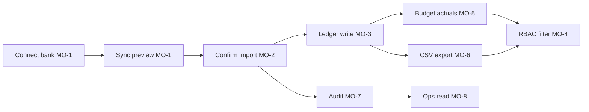

# Scope, IDs, and Traceability (Phase 1)

> **Status:** Frozen baseline for Homework 3. All later docs (`specification.md`, `docs/*`, mocks) and low-level tasks MUST use these identifiers. Do not rename without updating this file and the traceability matrix.

## North star

Household members in Ukraine see a **single, trustworthy view of booked bank spending** per household, connect Mono / OTP / Privat24 through one abstraction, confirm imports before they affect the ledger, plan budgets from **booked** transactions only, and export household data as **CSV**—with role-appropriate visibility, immutable audit, and UA-aligned privacy controls.

## MVP boundary (one sentence)

MVP delivers **bank API ingest → admin/superadmin confirm → deduplicated ledger → role-scoped budget → CSV export** on a NestJS + Angular + MongoDB (one DB per service, shared cluster) platform; **no** file upload, receipt OCR, or manual cash in MVP.

## Explicitly out of scope for MVP

| Item | Phase 2 ID | Notes |
|------|------------|--------|
| Bank statement / CSV file upload | `PH2-FILE` | Same confirmation + idempotency rules when specified |
| Receipt photo OCR | `PH2-OCR` | **Always confirm** before ledger write (policy locked) |
| Manual cash transactions | `PH2-CASH` | Requires separate trust/validation model |
| Cross-source dedup (receipt vs bank) | `PH2-XDEDUP` | Bank-only dedup in MVP; see dedup doc |
| Event bus / async messaging between services | — | REST + scheduled jobs only in MVP |
| Non-CSV export (PDF, XLSX) | — | CSV only in MVP |
| PostgreSQL / relational migration | — | Documented as post-MVP option on shared cluster |
| Real bank API keys, Docker, CI, application code | — | Homework is specification-only |

## Phase 2 (spec mention only — not MVP tasks)

Phase 2 extends ingestion with `PH2-FILE`, `PH2-OCR`, and `PH2-CASH`, enables `PH2-XDEDUP`, and may introduce PostgreSQL per service. MVP tasks and MO acceptance criteria MUST NOT require Phase 2 implementation.

---

## Document ID registry

### Mid-level objectives (`MO-*`)

| ID | Title | Observable outcome (MVP) |
|----|--------|---------------------------|
| **MO-1** | Bank connection and sync | A household admin connects Mono, OTP, or Privat24 via `BankProvider`; accounts list; incremental sync runs on schedule with checkpoint; tokens stored per lifecycle doc; disconnect/revoke supported. |
| **MO-2** | Import preview and confirmation | Pending transactions appear in preview; **admin** or **superadmin** confirms import; unconfirmed data never affects budget; superadmin can override household policy where documented. |
| **MO-3** | Idempotent ledger and dedup | Confirmed imports write to ledger once; duplicate provider/overlap cases follow dedup spec; budget and export read **booked** canonical rows only. |
| **MO-4** | Household RBAC and visibility | Roles enforced on every BFF-proxied action; admins see household-wide data; users/viewers see per-user scope; viewer cannot export or connect banks. |
| **MO-5** | Budget from booked spend | Categories, periods, limits; actuals from booked ledger only; rollup respects MO-4 visibility. |
| **MO-6** | CSV export and download | Authorized roles request async CSV; manifest columns and PII redaction per role; download audited. |
| **MO-7** | Immutable audit and UA compliance | Security-sensitive actions append to audit service; UA personal data minimization and erasure paths referenced; no tokens/PAN in logs. |
| **MO-8** | Ops / compliance read-only views | Internal ops/compliance role (or superadmin) can query audit and export history without mutating household data. |

### Services (`SVC-*`)

| ID | Service | MongoDB database (shared cluster) | Owns (MVP) |
|----|---------|-----------------------------------|------------|
| **SVC-BFF** | gateway-bff | *(none — stateless)* | Auth propagation, aggregation, no business writes |
| **SVC-ID** | identity-household | `identity_mvp` | Users, households, invitations, role bindings |
| **SVC-BANK** | bank-connector | `bank_mvp` | Provider adapters, connection tokens, sync jobs, import preview |
| **SVC-LED** | ledger | `ledger_mvp` | Canonical `transactions` collection (sole writer) |
| **SVC-BUD** | budget | `budget_mvp` | Categories, periods, limits, rollups (reads ledger) |
| **SVC-EXP** | export | `export_mvp` | CSV jobs, manifests, download tokens |
| **SVC-AUD** | audit | `audit_mvp` | Append-only audit events |

**Rules:** No cross-service collection writes. Ledger is the only writer of booked transactions. REST between services; no event bus in MVP.

### Phase 2 ingestion sources (`PH2-*`)

| ID | Source | Priority (plan) | MVP |
|----|--------|-----------------|-----|
| **PH2-FILE** | Uploaded bank file | Medium | Deferred |
| **PH2-OCR** | Receipt OCR | Medium | Deferred (always confirm when built) |
| **PH2-CASH** | Manual cash entry | Low | Deferred |
| **PH2-XDEDUP** | Cross-source deduplication | — | Deferred |
| **PH2-PET** | Pet allowance / non-human viewer banking | — | Deferred (demo Easter egg; `usr_mars_cat`) |

MVP bank sources (no `PH2-` prefix): **Mono**, **OTP**, **Privat24** — High priority; implemented via `BankProvider` port in `SVC-BANK`.

---

## Locked product decisions (no contradiction)

| Decision | Value |
|----------|--------|
| Import confirm | **Admin** and **superadmin**; superadmin is superset / override where stated |
| Budget data | **Booked** transactions only |
| Budget visibility | **Admin / superadmin:** household-wide; **user / viewer:** per-user scope |
| Export format | **CSV** only in MVP |
| Currency / jurisdiction | **UAH** (ISO 4217), **Ukraine** privacy law references |
| Integration | **REST** + scheduled sync jobs |
| Cluster | One **MongoDB cluster**, **separate DB name per service** (table above) |
| Mock household | **Mars Family** — mother superadmin, father admin, son/daughter user, cat + uncle + niece viewer |

---

## `specification.md` section outline

Use this order in the final graded artifact (Phase 4). Section numbers are stable anchors for backlinks.

| § | Section | Primary IDs / inputs |
|---|---------|----------------------|
| 1 | High-level objective | North star + MVP boundary sentence |
| 2 | Mid-level objectives | `MO-1` … `MO-8` with observable outcomes |
| 3 | Stakeholders | End-users (household), ops/compliance |
| 4 | Non-functional and policy | Security, UA privacy, audit, **assumed SLO table** |
| 5 | Implementation notes | TS stack, decimal money, idempotency, booked-only, REST, Mongo DB names |
| 6 | Ingestion sources | MVP banks + `PH2-*` deferred rows |
| 7 | BankProvider | Port summary + Mono/OTP/Privat24 deltas |
| 8 | Canonical model and dedup | Links to `canonical-banking-transaction-model.md`, dedup doc |
| 9 | Household RBAC | Matrix + `mocks/household-family.json` |
| 10 | Edge cases and failure modes | MVP-scoped table |
| 11 | Verification | Per `MO-*`: tests, fixtures, reconciliation, compliance steps |
| 12 | Context beginning / ending | Platform + per-`SVC-*` condensed from `docs/services/*` |
| 13 | Low-level tasks | 20–35 tasks, each tagged `MO-x`, with DoD |
| 14 | Phase 2 roadmap | `PH2-*` only — not in MVP task DoD |

---

## Traceability matrix

Full MO ↔ task counts and prefixes: [`traceability-matrix.md`](traceability-matrix.md) (38 tasks in [`specification.md` §13](../../specification.md#13-low-level-tasks)).

---

## MVP user flows (traceability sanity check)

---

## Spec incorporation

| `specification.md` section | Content from this doc |
|----------------------------|------------------------|
| §1–§2 | North star, MVP boundary, `MO-*` table |
| §13 | Traceability matrix → task prefixes |
| §11 | Verification grouped by `MO-*` |
| §14 | `PH2-*` deferred IDs |

**See also:** [`specification.md`](../../specification.md) — full layered spec (Phase 4 complete).

**Exit criteria (Phase 1):** IDs frozen; MVP vs Phase 2 unambiguous; admin/superadmin confirm, CSV-only export, booked-only budget, and cluster DB names consistent with plan; no implementation tasks assigned to `PH2-*`.
