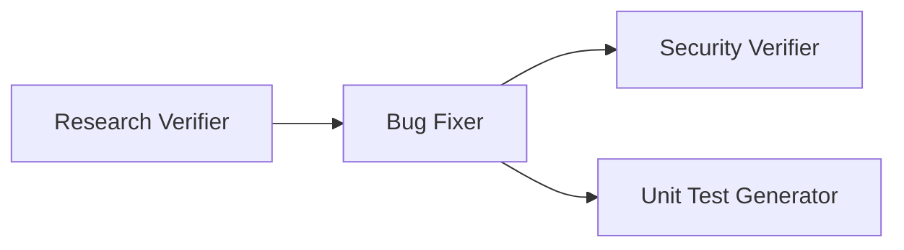

# Homework 4: 4-Agent Bug-Fix Pipeline

> **Student name:** Max Ogorodnikov  
> **AI tools used:** Cursor (IDE, Agent mode), Cursor CLI  
> **Status:** Tasks 1–4 complete; Task 5 (sample mini-app) pending

---

## Summary

Implements the required **four-agent pipeline** for homework 4:

1. **Bug Research Verifier** — fact-checks research and rates quality  
2. **Bug Fixer** — applies implementation plan and runs tests  
3. **Security Verifier** — security report on changed code (no edits)  
4. **Unit Test Generator** — FIRST-principled tests for changed code  

Single-command run: `npm run pipeline` from this folder.

| Deliverable | Path |
|-------------|------|
| Agent definitions | [`agents/`](agents/) |
| Skills | [`skills/`](skills/) |
| Agent guidelines | [`agents.md`](agents.md) |
| Per-agent docs | [`docs/agents/`](docs/agents/) |
| Bug context | [`context/bugs/BUG-001/`](context/bugs/BUG-001/) |
| How to run | [`HOWTORUN.md`](HOWTORUN.md) |
| Task spec | [`TASKS.md`](TASKS.md) |

---

## Pipeline flow



Upstream Bug Researcher and Bug Planner produce inputs before the automated pipeline runs. See [`agents.md`](agents.md).

---

## Model selection

| Agent | Model | Rationale |
|-------|-------|-----------|
| Research Verifier | `claude-sonnet-5-thinking-high` | Strong reasoning for file:line and snippet verification |
| Bug Fixer | `composer-2.5-fast` | Fast, cost-effective plan execution |
| Security Verifier | `claude-opus-4-8-thinking-high` | Deep security analysis |
| Unit Test Generator | `composer-2.5-fast` | Efficient test scaffolding |

Detail: [`agents.md` §3](agents.md#3-model-selection-rationale).

---

## Quick start

```bash
cd homework-4
npm install
npm run pipeline -- --dry-run   # validate config
npm run pipeline                # full run (requires Cursor CLI)
npm test
```

**Prerequisites:** `context/bugs/BUG-001/research/codebase-research.md` and `implementation-plan.md` must exist (stub seeded; Task 5 replaces with real app research).

---

## Task 5 boundary

The sample mini-application (`src/`, seeded bugs, security issue) will be added in **Task 5**. Until then, pipeline stubs use `TBD` markers in research/plan files.

---

## Screenshots

Place PR evidence in [`docs/screenshots/`](docs/screenshots/):

- Pipeline run (terminal)
- Verified research output
- Applied fixes
- Security report
- Test results

---

## AI usage

Agent definitions, skills, pipeline orchestrator, and documentation were authored with Cursor Agent from `TASKS.md`. Manual verification: re-check verified research claims against source and re-run `npm test` after pipeline execution.
