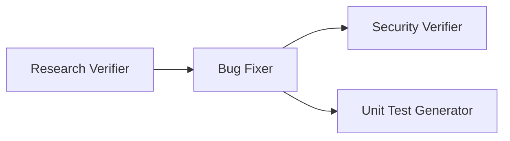

# Homework 4: 4-Agent Bug-Fix Pipeline

> **Student name:** Max Ogorodnikov  
> **AI tools used:** Cursor (IDE, Agent mode), Cursor CLI  
> **Status:** Tasks 1–5 complete (app with seeded bugs; pipeline fix is a separate step)

---

## Summary

Implements the required **four-agent pipeline** plus a **Svelte 5 leave request UI** (day off, vacation, sick leave) with intentional bugs for the pipeline to fix later.

| Component | Description |
|-----------|-------------|
| **Sample app** | Single-page Svelte UI — `npm run dev` |
| **4-agent pipeline** | `npm run pipeline` |
| **Seeded defects** | Documented in [`context/bugs/BUG-001/bug-context.md`](context/bugs/BUG-001/bug-context.md) |

| Deliverable | Path |
|-------------|------|
| Application source | [`src/`](src/) |
| Unit tests | [`test/`](test/) |
| Agent definitions | [`agents/`](agents/) |
| Skills | [`skills/`](skills/) |
| Agent guidelines | [`agents.md`](agents.md) |
| Per-agent docs | [`docs/agents/`](docs/agents/) |
| Bug context | [`context/bugs/BUG-001/`](context/bugs/BUG-001/) |
| How to run | [`HOWTORUN.md`](HOWTORUN.md) |
| Task spec | [`TASKS.md`](TASKS.md) |

---

## Pipeline flow



Upstream Bug Researcher and Bug Planner produce inputs before the automated pipeline runs. See [`agents.md`](agents.md).

---

## Model selection

| Agent | Model | Rationale |
|-------|-------|-----------|
| Research Verifier | `claude-sonnet-5-thinking-high` | Strong reasoning for file:line and snippet verification |
| Bug Fixer | `composer-2.5-fast` | Fast, cost-effective plan execution |
| Security Verifier | `claude-opus-4-8-thinking-high` | Deep security analysis |
| Unit Test Generator | `composer-2.5-fast` | Efficient test scaffolding |

Detail: [`agents.md` §3](agents.md#3-model-selection-rationale).

---

## Quick start

```bash
cd homework-4
npm install
npm run dev          # leave request UI → http://localhost:5173
npm test             # unit tests (pass with current buggy behavior)
npm run pipeline -- --dry-run   # validate pipeline config
npm run pipeline     # fix bugs via agents (separate step)
```

**Demo manager token:** `mgr-approve-2026`

### Seeded bugs (before pipeline)

| ID | Issue |
|----|-------|
| BUG-001a | Leave days off by one (inclusive range) |
| BUG-001b | End date before start date accepted |
| BUG-001c | Loose `==` token comparison |
| BUG-001d | XSS via `{@html}` reason preview |

Details: [`context/bugs/BUG-001/bug-context.md`](context/bugs/BUG-001/bug-context.md)

---

## Pipeline (separate step)

## Screenshots

Place PR evidence in [`docs/screenshots/`](docs/screenshots/):

- Pipeline run (terminal)
- Verified research output
- Applied fixes
- Security report
- Test results

---

## AI usage

Agent definitions, skills, pipeline orchestrator, and documentation were authored with Cursor Agent from `TASKS.md`. Manual verification: re-check verified research claims against source and re-run `npm test` after pipeline execution.
