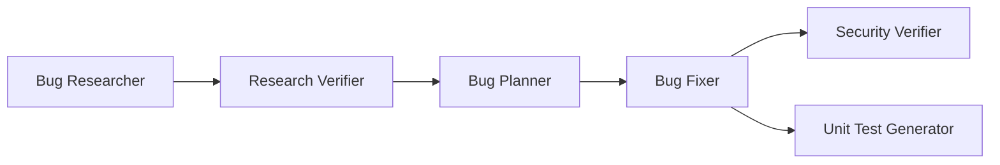

# Homework 4 — AI Agent Guidelines

> Use with [`TASKS.md`](TASKS.md), [`agents/*.agent.md`](agents/), [`skills/`](skills/), and [`HOWTORUN.md`](HOWTORUN.md). Per-agent reference: [`docs/agents/README.md`](docs/agents/README.md).

**Workspace:** Work only under `homework-4/` unless the user explicitly expands scope.

---

## 1. Pipeline context

Homework 4 implements a **4-agent bug-fix pipeline** that verifies research, applies fixes, reviews security, and generates unit tests. The sample mini-application (`src/`, Task 5) provides concrete files for agents to operate on.

### Full run order (including upstream)



**Automated by `npm run pipeline` (Tasks 1–4):** Research Verifier → Bug Fixer → *(parallel)* Security Verifier + Unit Test Generator.

Upstream **Bug Researcher** and **Bug Planner** are documented here but not implemented in Tasks 1–4; they produce `codebase-research.md` and `implementation-plan.md`.

---

## 2. Agent catalog

| Agent | Role | Model | Skills | Inputs | Outputs | Edits code? |
|-------|------|-------|--------|--------|---------|-------------|
| [research-verifier](agents/research-verifier.agent.md) | Fact-check research | `claude-sonnet-5-thinking-high` | `research-quality-measurement.md` | `research/codebase-research.md` | `research/verified-research.md` | No |
| [bug-fixer](agents/bug-fixer.agent.md) | Apply plan | `composer-2.5-fast` | — | `implementation-plan.md` | `fix-summary.md`, `src/` | Yes |
| [security-verifier](agents/security-verifier.agent.md) | Security review | `claude-opus-4-8-thinking-high` | — | `fix-summary.md` | `security-report.md` | No |
| [unit-test-generator](agents/unit-test-generator.agent.md) | Generate tests | `composer-2.5-fast` | `unit-tests-FIRST.md` | `fix-summary.md` | `test-report.md`, `test/` | Tests only |

---

## 3. Model selection rationale

| Agent | Model | Why |
|-------|-------|-----|
| Research Verifier | `claude-sonnet-5-thinking-high` | Line-by-line verification and snippet comparison need strong reasoning; errors block the planner |
| Bug Fixer | `composer-2.5-fast` | Deterministic edits from a written plan; speed and cost efficiency |
| Security Verifier | `claude-opus-4-8-thinking-high` | Deep security analysis; false negatives are costly |
| Unit Test Generator | `composer-2.5-fast` | Test scaffolding from known patterns; fast iteration |

Models are set in each `agents/*.agent.md` frontmatter and passed to Cursor CLI by `scripts/run-pipeline.ts`.

---

## 4. Context layout — `context/bugs/{BUG_ID}/`

| Path | Writer | Purpose |
|------|--------|---------|
| `bug-context.md` | Human / Task 5 | Bug summary and seeded issue description |
| `research/codebase-research.md` | Bug Researcher (upstream) | Unverified claims with file:line refs |
| `research/verified-research.md` | Research Verifier | Quality-rated verification report |
| `implementation-plan.md` | Bug Planner (upstream) | Before/after edits and test command |
| `fix-summary.md` | Bug Fixer | Applied changes and test results |
| `security-report.md` | Security Verifier | Severity-rated findings (report only) |
| `test-report.md` | Unit Test Generator | FIRST assessment and test run log |

Default bug id: `BUG-001` (override with `BUG_ID` env var).

---

## 5. Skills index

| Skill | Used by | When |
|-------|---------|------|
| [`skills/research-quality-measurement.md`](skills/research-quality-measurement.md) | Research Verifier | Assign L1–L4 quality; structure `verified-research.md` |
| [`skills/unit-tests-FIRST.md`](skills/unit-tests-FIRST.md) | Unit Test Generator | Fast, Independent, Repeatable, Self-validating, Timely tests |

Pipeline auto-inlines skill content into each agent prompt.

---

## 6. Agent workflow (read order)

### Research Verifier

1. `research/codebase-research.md`
2. Each cited source file under `homework-4/`
3. Write `verified-research.md` per skill template

### Bug Fixer

1. `implementation-plan.md`
2. Optional: `verified-research.md`
3. Apply edits; run `npm test` after changes
4. Write `fix-summary.md`

### Security Verifier

1. `fix-summary.md`
2. Changed files listed in summary
3. Write `security-report.md` only — no edits

### Unit Test Generator

1. `fix-summary.md`
2. Changed source files
3. Add tests under `test/`; run `npm test`
4. Write `test-report.md` with FIRST self-assessment

---

## 7. Pipeline invocation

```bash
cd homework-4
npm install
npm run pipeline          # full run
npm run pipeline -- --dry-run   # validate config without calling agent CLI
```

| Variable | Default | Purpose |
|----------|---------|---------|
| `BUG_ID` | `BUG-001` | Bug context folder name |

Steps 3a and 3b (security + tests) run **in parallel** after the fixer completes.

---

## 8. Upstream agents (out of scope for Tasks 1–4)

| Agent | Output | Notes |
|-------|--------|-------|
| Bug Researcher | `research/codebase-research.md` | Explores codebase; cites file:line and snippets |
| Bug Planner | `implementation-plan.md` | Uses verified research; specifies before/after and tests |

Stub inputs exist under `context/bugs/BUG-001/` until Task 5 provides real app and research.

---

## 9. AI usage notes

| Area | Approach |
|------|----------|
| Agent definitions | Authored with Cursor Agent from `TASKS.md` requirements |
| Skills | Rubrics and templates defined per task spec |
| Pipeline script | TypeScript orchestrator; Cursor CLI `agent -p --force` |
| Manual verification | Re-check file:line claims in verified research; re-run `npm test` after pipeline |

Document prompts and screenshots in `docs/screenshots/` for PR submission.

---

## 10. Related docs

- [`README.md`](README.md) — submission overview
- [`HOWTORUN.md`](HOWTORUN.md) — install and run
- [`docs/agents/`](docs/agents/) — per-agent reference pages
- [`.cursor/README.md`](.cursor/README.md) — Cursor skills index
