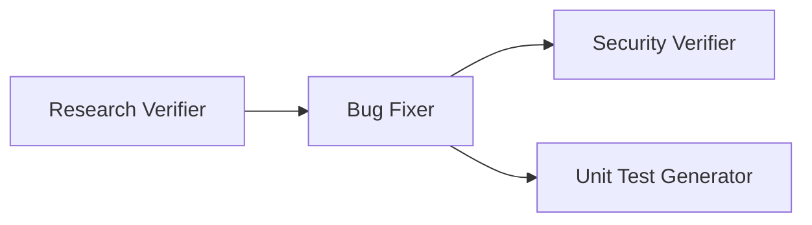

# Homework-4 Pipeline Report — BUG-001

| Field | Value |
|-------|-------|
| **Command** | `npm run pipeline` |
| **Bug ID** | `BUG-001` |
| **Workspace** | `homework-4/` |
| **Overall result** | **SUCCESS** — all steps completed; all expected outputs present |
| **Final test suite** | 18 / 18 passed (5 test files) |

---

## Pipeline flow



Steps 3 and 4 run in parallel after the Bug Fixer (`post-fix` group).

| Step | Agent | Model | Output |
|------|-------|-------|--------|
| 1 | Research Verifier | `claude-sonnet-5-thinking-high` | [`verified-research.md`](../context/bugs/BUG-001/research/verified-research.md) |
| 2 | Bug Fixer | `composer-2.5-fast` | [`fix-summary.md`](../context/bugs/BUG-001/fix-summary.md) |
| 3 | Security Verifier | `claude-opus-4-8-thinking-high` | [`security-report.md`](../context/bugs/BUG-001/security-report.md) |
| 4 | Unit Test Generator | `composer-2.5-fast` | [`test-report.md`](../context/bugs/BUG-001/test-report.md) |

---

## Step 1 — Research Verifier

**Input:** `context/bugs/BUG-001/research/codebase-research.md`  
**Skill:** `skills/research-quality-measurement.md`

Fact-checked all five `file:line` claims against source. Because the working tree already contained post-fix changes, pre-fix state was reconstructed via `git show HEAD:...` before comparing cited snippets.

| # | Location | Match | Status |
|---|----------|-------|--------|
| 1 | `src/lib/leave-days.ts:17` | Exact | VERIFIED |
| 2 | `src/lib/validators.ts:11` | Exact (elision marker aside) | VERIFIED |
| 3 | `src/lib/auth.ts:9` | Exact | VERIFIED |
| 4 | `src/lib/reason-html.ts:6` | Exact | VERIFIED |
| 5 | `src/App.svelte:85` | Snippet on line **86** (line 85 is comment) | VERIFIED (minor) |

**Outcome:** Overall **PASS** · Research Quality **L3 (Adequate)**  
**Discrepancies:** 1 minor (off-by-one line citation on `App.svelte` `{@html}` sink)  
**Action:** `verified-research.md` already matched independent re-verification — left unchanged.

---

## Step 2 — Bug Fixer

**Input:** `context/bugs/BUG-001/implementation-plan.md`

All four planned changes applied and documented in `fix-summary.md`:

| Change | File | Fix |
|--------|------|-----|
| 1 | `src/lib/leave-days.ts` | Inclusive day count (`+ 1` on return) |
| 2 | `src/lib/validators.ts` | Reject end date before start date |
| 3 | `src/lib/auth.ts` | Strict token comparison (`===`) |
| 4 | `src/lib/reason-html.ts` | `escapeHtml()` before HTML interpolation |

**Tests after fix:** `npm test` — **18 / 18 passed** (5 test files)  
**Status:** **SUCCESS**

---

## Step 3 — Security Verifier *(parallel)*

**Input:** `fix-summary.md` + changed source files + runtime consumers (`leave-service.ts`, `App.svelte`)

**Verdict:** Fixes are **security-positive**; **no regressions** introduced by the fix.

| Severity | Count |
|----------|-------|
| CRITICAL | 0 |
| HIGH | 0 |
| MEDIUM | 1 |
| LOW | 1 |
| INFO | 2 |

**Overall risk posture:** **LOW**

### Key verifications

- `src/lib/auth.ts:2` — exported `MANAGER_TOKEN` is bundled to client (pre-existing demo limitation).
- `src/lib/auth.ts:9` — `token === MANAGER_TOKEN` (strict; non-constant-time, negligible client-side).
- `src/lib/reason-html.ts:4-11` — `escapeHtml` escapes `& < > " '` (ampersand first); closes XSS sink at `src/App.svelte:86` via `leave-service.ts:30`.
- `src/lib/validators.ts:26-28` — date range check; input compared, never interpolated.
- `src/lib/leave-days.ts:20-22` — `parseDateOnly` has no `NaN` guard; no injection/crash risk.

Full findings table: [`security-report.md`](../context/bugs/BUG-001/security-report.md)

---

## Step 4 — Unit Test Generator *(parallel)*

**Input:** `fix-summary.md` + changed source files  
**Skill:** `skills/unit-tests-FIRST.md`

| Metric | Value |
|--------|-------|
| **Result** | PASS |
| **Tests** | 18 / 18 |
| **Files** | 5 test files |
| **Duration** | ~33 ms (test execution) |

### Coverage by fix

| Change | Source | Tests |
|--------|--------|-------|
| Inclusive day count | `leave-days.ts` | Same-day = 1, Jul 1–3 = 3, end-before-start = 0 |
| Date range validation | `validators.ts` | End before start rejected; equal dates accepted |
| Strict token check | `auth.ts` | Boxed `String` token rejected via `===` |
| HTML escaping | `reason-html.ts` | Script/img tags escaped; plain text preserved |
| Integration | `leave-service.ts` | Multi-day count, range rejection, safe `reasonHtml` |

### FIRST self-assessment

| Principle | Satisfied |
|-----------|-----------|
| Fast | Yes — pure unit tests, no I/O |
| Independent | Yes — `resetSubmissionCounter()` per test |
| Repeatable | Yes — fixed dates/tokens |
| Self-validating | Yes — `expect()` throughout |
| Timely | Yes — scope limited to fix-summary paths |

Full report: [`test-report.md`](../context/bugs/BUG-001/test-report.md)

---

## Seeded defects — before / after

| ID | Issue | Resolution |
|----|-------|------------|
| BUG-001a | Leave days off by one | Inclusive `+ 1` in `calculateLeaveDays` |
| BUG-001b | End before start accepted | Range validation in `validateLeaveRequest` |
| BUG-001c | Loose `==` token comparison | Strict `===` in `isManagerTokenValid` |
| BUG-001d | XSS via `{@html}` reason preview | `escapeHtml()` in `formatReasonAsHtml` |

---

## Artifact index

| Artifact | Path |
|----------|------|
| Bug context | `context/bugs/BUG-001/bug-context.md` |
| Codebase research | `context/bugs/BUG-001/research/codebase-research.md` |
| Verified research | `context/bugs/BUG-001/research/verified-research.md` |
| Implementation plan | `context/bugs/BUG-001/implementation-plan.md` |
| Fix summary | `context/bugs/BUG-001/fix-summary.md` |
| Security report | `context/bugs/BUG-001/security-report.md` |
| Test report | `context/bugs/BUG-001/test-report.md` |

---

## Screenshots

Pipeline run evidence (terminal output):

| Screenshot | Description |
|------------|-------------|
| [`screenshots/pipline-1.png`](../screenshots/pipline-1.png) | Pipeline start / research verifier |
| [`screenshots/pipline-2.png`](../screenshots/pipline-2.png) | Bug fixer |
| [`screenshots/pipline-3.png`](../screenshots/pipline-3.png) | Post-fix parallel steps |
| [`screenshots/pipline-4.png`](../screenshots/pipline-4.png) | Pipeline finished successfully |

---

## Manual verification

From `homework-4/`:

```bash
npm test          # expect 18/18 passed
npm run dev       # http://localhost:5173
```

1. Submit leave Jul 1–Jul 3 with token `mgr-approve-2026` — confirmation shows **3** days.
2. Set end date before start date — form shows range error and does not submit.
3. Enter reason `<script>alert('xss')</script>` — preview shows escaped text, no script execution.

---

## Conclusion

The four-agent pipeline for **BUG-001** completed successfully:

- Research verified at **L3 Adequate** with one minor line-citation discrepancy.
- All four implementation-plan fixes applied; unit tests pass.
- Security review confirms XSS remediation and strict token comparison; overall risk **LOW**.
- Test generator confirms **FIRST** principles and full coverage of changed behavior.

**Pipeline finished successfully.**
