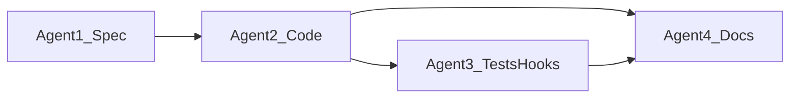
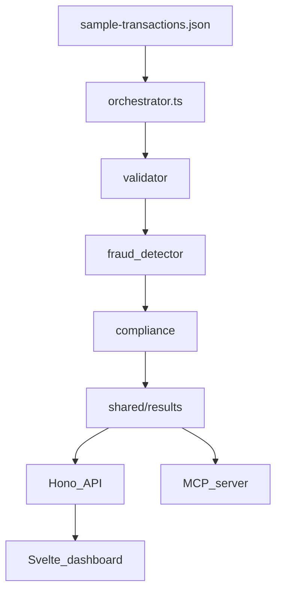

# Homework 6 — AI Agent Guidelines

> Use with [`TASKS.md`](TASKS.md), [`specification.md`](specification.md), [`SUCCESS_CRITERIA.md`](SUCCESS_CRITERIA.md), and Cursor config under [`.cursor/`](.cursor/).

**Author:** Maxim Ogorodnikov  
**Workspace:** Work only under `homework-6/` unless the user explicitly expands scope.

---

## 1. Capstone overview

Homework 6 builds an **AI-powered transaction processing pipeline** using four workflow agents:

| Agent | Role | Deliverable |
|-------|------|-------------|
| **Agent 1 — Specification** | Writes the technical spec before any code | `specification.md`, `agents.md`, `/write-spec` skill |
| **Agent 2 — Code generation** | Implements the pipeline and front-end | Orchestrator, pipeline stages, Hono API, Svelte dashboard |
| **Agent 3 — Unit tests** | Tests + workflow automation | `/run-pipeline`, `/validate-transactions`, coverage gate hook |
| **Agent 4 — Documentation** | README, HOWTORUN, presentation | Docs with student name, screenshots, PDF |

### Four-agent workflow



**Rule:** Spec first, code second. Do not skip Task 1.

---

## 2. Tech stack

| Layer | Technology | Role |
|-------|------------|------|
| Runtime | Node.js 18+ | Pipeline orchestrator, stage modules, MCP server |
| Language | TypeScript (ESM) | End-to-end type safety across pipeline and API |
| Pipeline / API | [Hono](https://hono.dev/) + `@hono/node-server` | REST endpoints to trigger runs and serve results |
| Front-end | [Vite](https://vite.dev/) + [Svelte 5](https://svelte.dev/) | Web dashboard for pipeline runs and transaction status |
| Money handling | `decimal.js` | Precise decimal arithmetic — no `float` for amounts |
| Storage / IPC | File system (`shared/input`, `processing`, `output`, `results`) | JSON records passed between pipeline stages |
| Testing | [Vitest](https://vitest.dev/) + coverage (`v8`) | Unit tests per stage + integration test; 80% gate |
| Dev tooling | `tsx` | Run TypeScript in dev and scripts |
| MCP | `@modelcontextprotocol/sdk` + context7 | Custom `pipeline-status` server + framework docs lookup |

---

## 3. Pipeline architecture



### Pipeline stages (minimum)

1. **Validation** — required fields, positive decimal amounts, ISO 4217 currency
2. **Fraud Detection** — risk score from high-value, cross-border, unusual timing, wire type
3. **Compliance Check** — reporting thresholds; final status and `pipeline-summary.json`

### File-based protocol

```
shared/
├── input/       ← orchestrator drops initial records
├── processing/  ← stage moves record here while working
├── output/      ← stage writes result for next stage
└── results/     ← final outcomes (rejected or completed)
```

---

## 4. Business rules (quick reference)

### Validation

- Required: `transaction_id`, `timestamp`, `source_account`, `destination_account`, `amount`, `currency`, `transaction_type`, `description`
- `amount` parsed with `decimal.js`; must be `> 0`
- `currency` must be valid ISO 4217 (`USD`, `EUR`, `GBP`, `JPY`, …)
- Invalid records → `shared/results/{transaction_id}.json` with `status: rejected` and `reason`

### Fraud scoring (0–100)

| Signal | Points |
|--------|--------|
| Amount ≥ $10,000 USD equivalent | +40 |
| `metadata.country` ≠ `US` | +25 |
| Hour (UTC) 02:00–05:00 | +20 |
| `transaction_type === "wire_transfer"` | +15 |

- `fraud_review` if score ≥ 50; otherwise pass as `approved` to compliance
- Attach `risk_score` and `fraud_signals[]` to envelope `data`

### Compliance

- `compliance_status: flagged` when: (wire transfer AND amount ≥ $10,000) OR fraud score ≥ 50
- Otherwise `compliance_status: cleared`
- Write `shared/results/{transaction_id}.json` with `final_status`, `reason`, compliance fields
- After all records: emit `shared/results/pipeline-summary.json`

### Logging & PII

- Every stage logs: ISO 8601 timestamp, stage name, `transaction_id`, outcome
- **Never** log plaintext account numbers or names; mask as `ACC-****` if referenced

---

## 5. Expected outcomes (sample data)

Full table in [`specification.md` §4](specification.md#4-context).

| ID | Amount | Currency | Signals | Expected final status |
|----|--------|----------|---------|----------------------|
| TXN001 | 1500.00 | USD | normal transfer | `approved` |
| TXN002 | 25000.00 | USD | wire, high-value | `fraud_review` → compliance `flagged` |
| TXN003 | 9999.99 | USD | just under $10k | `approved` |
| TXN004 | 500.00 | EUR | 02:47 UTC, DE | `approved` (score 45) |
| TXN005 | 75000.00 | USD | wire, very high | `fraud_review` → compliance `flagged` |
| TXN006 | 200.00 | XYZ | invalid currency | `rejected` (validation) |
| TXN007 | -100.00 | GBP | negative amount | `rejected` (validation) |
| TXN008 | 3200.00 | USD | normal mobile | `approved` |

---

## 6. Project layout (planned)

```text
homework-6/
  specification.md
  agents.md
  SUCCESS_CRITERIA.md
  sample-transactions.json
  src/
    orchestrator.ts
    pipeline/
      validator.ts
      fraud-detector.ts
      compliance.ts
    api/                     # Hono app (Task 2)
  frontend/                  # Vite + Svelte 5 (Task 2)
  shared/{input,processing,output,results}/
  tests/
  mcp/
  docs/screenshots/
  docs/screenshots/
  .cursor/commands/
  .cursor/hooks.json
  .cursor/hooks/
```

---

## 7. Cursor commands (skills)

| Command | File | Purpose |
|---------|------|---------|
| `/write-spec` | [`.cursor/commands/write-spec.md`](.cursor/commands/write-spec.md) | Regenerate specification from template |
| `/run-pipeline` | [`.cursor/commands/run-pipeline.md`](.cursor/commands/run-pipeline.md) | End-to-end pipeline run + results summary |
| `/validate-transactions` | [`.cursor/commands/validate-transactions.md`](.cursor/commands/validate-transactions.md) | Validator dry-run on sample data |

---

## 8. Hooks

Coverage gate blocks `git push` when test coverage is below **80%**.

| File | Role |
|------|------|
| [`.cursor/hooks.json`](.cursor/hooks.json) | Registers `beforeShellExecution` hook (TASKS checklist: coverage gate hook / `settings.json` equivalent) |
| [`.cursor/hooks/coverage-gate.mjs`](.cursor/hooks/coverage-gate.mjs) | Runs `npm run test:coverage`; denies push on failure |

When the workspace is the repo root, see also [`../.cursor/hooks.json`](../.cursor/hooks.json).

---

## 9. Repo-root skills (reuse)

| Skill | When |
|-------|------|
| [`.cursor/skills/hono-backend/SKILL.md`](../.cursor/skills/hono-backend/SKILL.md) | Hono API structure, routes, `app.request()` tests |
| [`.cursor/skills/vitest-testing/SKILL.md`](../.cursor/skills/vitest-testing/SKILL.md) | Unit and integration tests, coverage |
| [`.cursor/skills/commit-messages/SKILL.md`](../.cursor/skills/commit-messages/SKILL.md) | Git commits |
| [`.cursor/skills/pr-messages/SKILL.md`](../.cursor/skills/pr-messages/SKILL.md) | PR description for submission |

---

## 10. MCP & context7 (Task 2+)

Agent 2 should use **context7** during code generation to look up:

- Hono routing and `@hono/node-server`
- `decimal.js` monetary arithmetic
- Svelte 5 component patterns (front-end)

Document at least 2 queries in `research-notes.md`.

Custom MCP server (`pipeline-status`) exposes `get_transaction_status`, `list_pipeline_results`, and resource `pipeline://summary`.

---

## 11. Related docs

- [`TASKS.md`](TASKS.md) — assignment requirements
- [`specification.md`](specification.md) — primary product spec (graded)
- [`SUCCESS_CRITERIA.md`](SUCCESS_CRITERIA.md) — live submission checklist
- [`specification-TEMPLATE-hint.md`](specification-TEMPLATE-hint.md) — template for `/write-spec`
